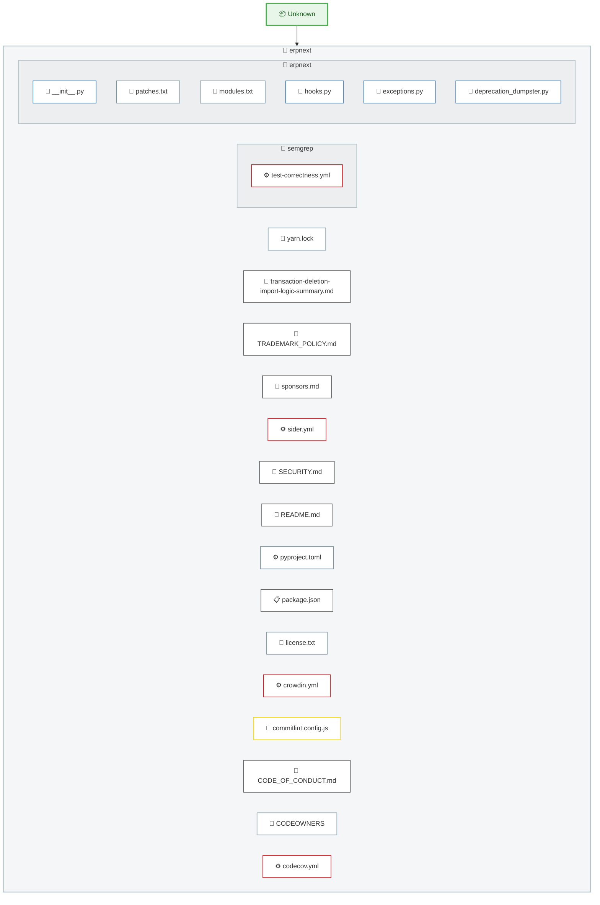

# Code Analysis Report: erpnext

| Property | Value |
|----------|-------|
| **Generated** | 2026-04-13T04:50:59.434Z |
| **Project** | C:\\Users\\kktam\\Documents\\code\\erpnext |
| **Duration** | 68394ms |
| **Tools Used** | architecture, api, metrics, dependencies |

---

## Summary

Analysis complete: 4 tools ran successfully, 0 failed.

---

## Architecture Analysis

**Framework:** Unknown
**Source Files:** 3183
**Total Lines:** 53,421

### File Types

| Extension | Count |
|-----------|-------|
| .js | 31 |
| .py | 269 |

### Project Structure

    - **erpnext** (17 files)
      - **semgrep** (1 files)
      - **erpnext** (6 files)

### Architecture Type

**Type:** Simple Application
**Confidence:** low

**Evidence:**
- Standard application structure

### Infrastructure & Deployment

**Deployment:** unknown
**Operating System:** Not specified (likely cloud-managed)

**Evidence:**
- No explicit cloud or infrastructure configuration detected

### Design Patterns

| Pattern | Category | Confidence | Evidence | Evidence Location |
|---------|----------|------------|----------|-------------------|
| Factory Pattern | Creational (GoF) | low | Object creation factory methods detected | `erpnext\erpnext\utilities\bulk_transaction.py:117` |
| Observer / Event Emitter Pattern | Behavioral (GoF) | high | Event emission or subscription detected | `erpnext\erpnext\stock\stock_balance.py:203` |
| Decorator / Annotation Pattern | Structural | medium | Decorators/annotations used (e.g., @Inject, @Route, @Component) | `erpnext\erpnext\__init__.py:139` |
| MVC (Model-View-Controller) | Architectural | medium | Controllers, Views, and Models detected | `erpnext\erpnext\tests\utils.py:164` |

### Scalability Analysis

**Scalable:** Yes
**Level:** moderate
**Orchestration:** none

**Scaling Methods:**
- Load Balancer / CDN
- Caching Layer (Redis/Cache)
- Message Queue (async processing)

**Evidence:**
- Load balancing or CDN configuration detected
- Caching infrastructure detected for horizontal scaling
- Message queue enables decoupled horizontal scaling

## Project Structure

## API Routes

**Framework:** node-http
**Total Routes:** 6542
**Unique Paths:** 1173

### Route List

| Method | Path | File |
|--------|------|------|
| GET, GET, GET, GET, GET, GET, GET, GET, GET, GET, GET, GET, GET, GET, GET, GET, GET, GET, GET, GET, GET, GET, GET, GET, GET, GET, GET, GET, GET, GET, GET, GET, GET, GET, GET, GET, GET, GET, GET, GET, GET, GET, GET, GET, GET, GET, GET, GET, GET, GET | `is_return` | erpnext\erpnext\utilities\transaction_base.py |
| GET | `is_child_table` | erpnext\erpnext\utilities\transaction_base.py |
| GET | `allow_duplicate_prev_row_id` | erpnext\erpnext\utilities\transaction_base.py |
| GET, GET, GET, GET, GET, GET | `is_internal_supplier` | erpnext\erpnext\utilities\transaction_base.py |
| GET, GET, GET, GET, GET, GET, GET, GET, GET, GET, GET, GET, GET, GET, GET, GET, GET, GET, GET, GET, GET, GET, GET, GET, GET, GET, GET, GET, GET, GET, GET, GET, GET, GET, GET, GET, GET, GET, GET, GET, GET, GET, GET, GET, GET, GET, GET, GET, GET, GET, GET, GET, GET, GET, GET, GET, GET, GET, GET, GET, GET, GET, GET, GET, GET, GET, GET, GET, GET, GET, GET, GET, GET, GET, GET, GET, GET, GET, GET, GET, GET, GET, GET, GET, GET, GET, GET, GET, GET, GET, GET, GET, GET, GET, GET, GET, GET, GET, GET, GET, GET, GET, GET, GET, GET, GET, GET, GET, GET, GET, GET, GET, GET, GET, GET, GET, GET, GET, GET, GET, GET, GET, GET, GET, GET, GET, GET, GET, GET, GET, GET, GET, GET, GET, GET, GET, GET, GET, GET, GET, GET, GET, GET, GET, GET, GET, GET, GET, GET, GET, GET, GET, GET, GET, GET, GET, GET, GET, GET, GET, GET, GET, GET, GET, GET, GET, GET, GET, GET, GET, GET, GET, GET, GET, GET, GET, GET, GET, GET, GET, GET, GET, GET, GET, GET, GET, GET, GET, GET, GET, GET, GET, GET, GET, GET, GET, GET, GET, GET, GET, GET, GET, GET, GET, GET, GET, GET, GET, GET, GET, GET, GET, GET, GET, GET, GET, GET, GET, GET, GET, GET, GET, GET, GET, GET, GET, GET, GET, GET, GET, GET, GET, GET, GET, GET, GET, GET, GET, GET, GET, GET, GET, GET, GET, GET, GET, GET, GET, GET, GET, GET, GET, GET, GET, GET, GET, GET, GET, GET, GET, GET, GET, GET, GET, GET, GET, GET, GET, GET, GET, GET, GET, GET, GET, GET, GET, GET, GET, GET, GET, GET, GET, GET, GET, GET, GET, GET, GET, GET, GET, GET, GET, GET, GET, GET, GET, GET, GET, GET, GET, GET, GET, GET, GET, GET, GET, GET, GET, GET, GET, GET, GET, GET, GET, GET, GET, GET, GET, GET, GET, GET, GET, GET, GET, GET, GET, GET, GET, GET, GET, GET, GET, GET, GET, GET, GET, GET, GET, GET, GET, GET, GET, GET, GET, GET, GET, GET, GET, GET, GET, GET, GET, GET, GET, GET, GET, GET, GET, GET, GET, GET, GET, GET, GET, GET, GET, GET, GET, GET, GET, GET, GET, GET, GET, GET, GET, GET, GET, GET, GET, GET, GET, GET, GET, GET, GET, GET, GET, GET, GET, GET, GET, GET, GET, GET, GET, GET, GET, GET, GET, GET, GET, GET, GET, GET, GET, GET, GET, GET, GET, GET, GET, GET, GET, GET, GET, GET, GET, GET, GET, GET, GET, GET, GET, GET, GET, GET, GET, GET, GET, GET, GET, GET, GET, GET, GET, GET, GET, GET, GET, GET, GET, GET, GET, GET, GET, GET, GET, GET, GET, GET, GET, GET, GET, GET, GET, GET, GET, GET, GET, GET, GET, GET, GET, GET, GET, GET, GET, GET, GET, GET, GET, GET, GET, GET, GET, GET, GET, GET, GET, GET, GET, GET, GET, GET, GET, GET, GET, GET, GET, GET, GET, GET, GET, GET, GET, GET, GET, GET, GET, GET, GET, GET, GET, GET, GET, GET, GET, GET, GET, GET, GET, GET, GET, GET, GET, GET, GET, GET, GET, GET, GET, GET, GET, GET, GET, GET, GET, GET, GET, GET, GET, GET, GET, GET, GET, GET, GET, GET, GET, GET, GET, GET, GET, GET, GET, GET, GET, GET, GET, GET, GET, GET, GET, GET, GET, GET, GET, GET, GET, GET, GET, GET, GET, GET, GET, GET, GET, GET, GET, GET, GET, GET, GET, GET, GET, GET, GET, GET, GET, GET, GET, GET, GET, GET, GET, GET, GET, GET, GET, GET, GET, GET, GET, GET, GET, GET, GET, GET, GET, GET, GET, GET, GET, GET, GET, GET, GET, GET, GET, GET, GET, GET, GET, GET, GET, GET, GET, GET, GET, GET, GET, GET, GET, GET, GET, GET, GET, GET, GET, GET, GET, GET, GET, GET, GET, GET, GET, GET, GET, GET, GET, GET, GET, GET, GET, GET, GET, GET, GET, GET, GET, GET, GET, GET, GET, GET, GET, GET, GET, GET, GET, GET, GET, GET, GET, GET, GET, GET, GET, GET, GET, GET, GET, GET, GET, GET, GET, GET, GET, GET, GET, GET, GET, GET, GET, GET, GET, GET, GET, GET, GET, GET, GET, GET, GET, GET, GET, GET, GET, GET, GET, GET, GET, GET, GET, GET, GET, GET, GET, GET, GET, GET, GET, GET, GET, GET, GET, GET, GET, GET, GET, GET, GET, GET, GET, GET, GET, GET, GET, GET, GET, GET, GET, GET, GET, GET | `items` | erpnext\erpnext\utilities\transaction_base.py |
| GET, GET, GET | `delivered_by_supplier` | erpnext\erpnext\utilities\transaction_base.py |
| GET, GET, GET, GET, GET, GET, GET, GET, GET, GET, GET, GET, GET, GET, GET, GET, GET, GET, GET, GET, GET, GET, GET, GET, GET, GET, GET, GET, GET, GET, GET, GET, GET, GET, GET, GET, GET, GET, GET, GET, GET, GET, GET, GET, GET, GET, GET, GET, GET, GET, GET, GET, GET, GET, GET, GET, GET, GET, GET, GET, GET, GET, GET, GET, GET, GET, GET, GET, GET, GET, GET, GET, GET, GET, GET, GET, GET, GET, GET, GET, GET, GET, GET, GET, GET, GET, GET, GET, GET, GET, GET, GET, GET, GET, GET, GET, GET, GET, GET, GET, GET, GET, GET, GET, GET, GET, GET, GET, GET, GET, GET, GET, GET, GET, GET, GET, GET, GET, GET, GET, GET, GET, GET, GET, GET, GET, GET, GET, GET, GET, GET, GET, GET, GET, GET, GET, GET, GET, GET, GET, GET, GET, GET, GET, GET, GET, GET, GET, GET, GET, GET, GET, GET, GET, GET, GET, GET, GET, GET, GET, GET, GET, GET, GET, GET, GET, GET, GET, GET, GET, GET, GET, GET, GET, GET, GET, GET, GET, GET, GET, GET, GET, GET, GET, GET, GET, GET, GET, GET, GET, GET, GET, GET, GET, GET, GET, GET, GET | `item_code` | erpnext\erpnext\utilities\transaction_base.py |
| GET, GET, GET | `barcode` | erpnext\erpnext\utilities\transaction_base.py |
| GET, GET, GET, GET, GET, GET, GET, GET, GET, GET, GET, GET, GET, GET, GET, GET, GET, GET, GET, GET, GET, GET, GET, GET, GET, GET, GET, GET, GET, GET, GET, GET, GET, GET, GET, GET, GET, GET, GET, GET, GET, GET, GET, GET, GET, GET, GET, GET, GET, GET, GET, GET, GET, GET, GET, GET, GET, GET | `serial_no` | erpnext\erpnext\utilities\transaction_base.py |
| GET, GET, GET, GET, GET, GET, GET, GET, GET, GET, GET, GET, GET, GET, GET, GET, GET, GET, GET, GET, GET, GET, GET, GET, GET, GET, GET, GET, GET, GET, GET, GET, GET, GET, GET, GET, GET, GET, GET, GET, GET, GET, GET, GET, GET, GET, GET, GET, GET, GET, GET, GET, GET, GET, GET, GET, GET, GET, GET, GET, GET, GET, GET, GET, GET, GET, GET, GET | `batch_no` | erpnext\erpnext\utilities\transaction_base.py |
| GET | `set_warehouse` | erpnext\erpnext\utilities\transaction_base.py |
| GET, GET, GET, GET, GET, GET, GET, GET, GET, GET, GET, GET, GET, GET, GET, GET, GET, GET, GET, GET, GET, GET, GET, GET, GET, GET, GET, GET, GET, GET, GET, GET, GET, GET, GET, GET, GET, GET, GET, GET, GET, GET, GET, GET, GET, GET, GET, GET, GET, GET, GET, GET, GET, GET, GET, GET, GET, GET, GET, GET, GET, GET, GET, GET, GET, GET, GET, GET, GET, GET, GET, GET, GET, GET, GET, GET, GET, GET, GET, GET, GET, GET, GET, GET, GET, GET, GET, GET, GET, GET, GET, GET, GET, GET, GET, GET, GET, GET, GET, GET, GET, GET, GET, GET, GET, GET, GET, GET, GET, GET, GET, GET, GET, GET, GET, GET, GET, GET, GET, GET, GET, GET, GET, GET, GET, GET, GET, GET, GET, GET, GET, GET, GET, GET, GET, GET, GET | `warehouse` | erpnext\erpnext\utilities\transaction_base.py |
| GET, GET, GET, GET, GET, GET, GET, GET, GET, GET, GET, GET, GET, GET, GET, GET, GET, GET, GET, GET, GET, GET, GET, GET, GET, GET, GET, GET, GET, GET, GET | `customer` | erpnext\erpnext\utilities\transaction_base.py |
| GET | `quotation_to` | erpnext\erpnext\utilities\transaction_base.py |
| GET, GET, GET, GET, GET, GET, GET, GET, GET, GET, GET, GET, GET, GET, GET, GET, GET, GET, GET, GET, GET, GET, GET, GET, GET | `supplier` | erpnext\erpnext\utilities\transaction_base.py |
| GET, GET, GET, GET, GET, GET, GET, GET, GET, GET, GET, GET, GET, GET, GET, GET, GET, GET, GET, GET, GET, GET, GET, GET, GET, GET, GET, GET, GET, GET, GET, GET, GET, GET, GET | `currency` | erpnext\erpnext\utilities\transaction_base.py |
| GET, GET, GET, GET, GET, GET, GET, GET | `is_internal_customer` | erpnext\erpnext\utilities\transaction_base.py |
| GET, GET, GET, GET, GET, GET, GET, GET, GET, GET, GET, GET, GET, GET, GET, GET, GET, GET, GET, GET, GET, GET, GET, GET, GET, GET, GET | `conversion_rate` | erpnext\erpnext\utilities\transaction_base.py |
| GET, GET, GET, GET, GET, GET, GET, GET, GET | `selling_price_list` | erpnext\erpnext\utilities\transaction_base.py |
| GET, GET | `price_list_currency` | erpnext\erpnext\utilities\transaction_base.py |
| GET | `plc_conversion_rate` | erpnext\erpnext\utilities\transaction_base.py |
| GET, GET, GET, GET, GET, GET, GET, GET, GET, GET, GET, GET, GET, GET, GET, GET, GET, GET, GET, GET, GET, GET, GET, GET, GET, GET, GET, GET, GET, GET, GET, GET, GET, GET, GET, GET, GET, GET, GET, GET, GET, GET, GET, GET, GET, GET, GET, GET, GET, GET, GET, GET, GET, GET, GET, GET, GET, GET, GET, GET, GET, GET, GET, GET, GET, GET, GET, GET, GET, GET, GET, GET, GET, GET, GET, GET, GET, GET, GET, GET, GET, GET, GET, GET, GET, GET, GET, GET, GET, GET, GET, GET, GET, GET, GET, GET, GET, GET, GET, GET, GET, GET, GET, GET, GET, GET, GET, GET, GET, GET, GET, GET, GET, GET, GET, GET, GET, GET, GET, GET, GET, GET, GET, GET, GET, GET, GET, GET, GET, GET, GET, GET, GET, GET, GET, GET, GET, GET, GET, GET, GET, GET, GET, GET, GET, GET, GET, GET, GET, GET, GET, GET, GET, GET, GET, GET, GET, GET, GET, GET, GET, GET, GET, GET, GET, GET, GET, GET, GET, GET, GET, GET, GET, GET, GET, GET, GET, GET, GET, GET, GET, GET, GET, GET, GET, GET, GET, GET, GET, GET, GET, GET, GET, GET, GET, GET, GET, GET, GET, GET, GET, GET, GET, GET, GET, GET, GET, GET, GET, GET, GET, GET, GET, GET, GET, GET | `company` | erpnext\erpnext\utilities\transaction_base.py |
| GET | `order_type` | erpnext\erpnext\utilities\transaction_base.py |
| GET, GET, GET, GET, GET, GET, GET, GET, GET, GET, GET, GET | `is_pos` | erpnext\erpnext\utilities\transaction_base.py |
| GET, GET, GET, GET, GET, GET, GET | `is_subcontracted` | erpnext\erpnext\utilities\transaction_base.py |
| GET, GET, GET | `ignore_pricing_rule` | erpnext\erpnext\utilities\transaction_base.py |
| GET, GET, GET, GET, GET, GET, GET, GET, GET, GET, GET, GET, GET, GET, GET, GET, GET, GET, GET, GET, GET, GET, GET, GET, GET, GET, GET, GET, GET, GET, GET, GET, GET, GET, GET, GET, GET, GET, GET, GET, GET, GET, GET, GET, GET, GET, GET, GET, GET, GET, GET, GET, GET, GET, GET, GET, GET, GET, GET, GET, GET, GET, GET, GET, GET, GET, GET, GET | `doctype` | erpnext\erpnext\utilities\transaction_base.py |
| GET, GET, GET, GET, GET, GET, GET, GET, GET, GET, GET, GET, GET, GET, GET, GET, GET, GET, GET, GET, GET, GET, GET, GET, GET, GET, GET, GET, GET, GET, GET, GET, GET, GET, GET, GET, GET, GET, GET, GET, GET, GET, GET, GET, GET, GET, GET, GET, GET, GET, GET, GET, GET, GET, GET, GET, GET, GET, GET, GET, GET, GET, GET, GET, GET, GET, GET, GET, GET, GET, GET, GET, GET, GET, GET, GET, GET, GET, GET, GET, GET, GET, GET, GET, GET, GET, GET, GET, GET, GET, GET, GET, GET, GET, GET, GET, GET, GET, GET, GET, GET, GET, GET, GET, GET, GET, GET, GET, GET, GET, GET, GET, GET, GET, GET, GET, GET, GET, GET, GET, GET, GET, GET | `name` | erpnext\erpnext\utilities\transaction_base.py |
| GET, GET, GET, GET, GET, GET, GET, GET, GET, GET, GET, GET, GET, GET, GET, GET, GET, GET, GET, GET, GET, GET, GET, GET, GET, GET, GET, GET, GET, GET, GET, GET, GET, GET, GET, GET, GET, GET, GET, GET, GET, GET, GET, GET, GET, GET, GET, GET, GET | `project` | erpnext\erpnext\utilities\transaction_base.py |
| GET, GET, GET, GET, GET, GET, GET, GET, GET, GET, GET, GET, GET, GET, GET, GET, GET, GET, GET, GET, GET, GET, GET, GET, GET, GET, GET, GET, GET, GET, GET, GET, GET, GET, GET, GET, GET, GET, GET, GET, GET, GET, GET, GET, GET, GET, GET, GET, GET, GET, GET, GET, GET, GET, GET, GET, GET, GET, GET, GET, GET, GET, GET, GET, GET, GET, GET, GET, GET, GET, GET, GET, GET, GET, GET, GET, GET, GET, GET, GET, GET, GET, GET, GET, GET, GET, GET, GET, GET, GET, GET, GET, GET, GET, GET, GET, GET, GET, GET, GET, GET, GET, GET, GET, GET, GET, GET, GET, GET, GET, GET, GET, GET, GET, GET, GET | `qty` | erpnext\erpnext\utilities\transaction_base.py |
| GET, GET, GET, GET, GET, GET, GET, GET, GET, GET, GET, GET, GET, GET, GET, GET, GET, GET, GET, GET, GET, GET, GET, GET, GET, GET | `rate` | erpnext\erpnext\utilities\transaction_base.py |
| GET, GET, GET, GET, GET | `base_net_rate` | erpnext\erpnext\utilities\transaction_base.py |
| GET, GET, GET, GET, GET, GET, GET, GET, GET, GET, GET, GET, GET, GET, GET, GET, GET, GET, GET, GET, GET, GET | `stock_qty` | erpnext\erpnext\utilities\transaction_base.py |
| GET, GET, GET, GET, GET, GET, GET, GET, GET, GET, GET, GET, GET, GET, GET, GET, GET, GET, GET, GET, GET, GET, GET, GET, GET, GET, GET, GET, GET, GET, GET, GET, GET, GET, GET, GET, GET, GET, GET, GET, GET, GET | `conversion_factor` | erpnext\erpnext\utilities\transaction_base.py |
| GET, GET | `weight_per_unit` | erpnext\erpnext\utilities\transaction_base.py |
| GET, GET, GET, GET, GET, GET, GET, GET, GET, GET, GET, GET, GET, GET, GET, GET, GET, GET, GET, GET, GET, GET, GET, GET, GET, GET, GET, GET, GET, GET, GET, GET, GET, GET | `uom` | erpnext\erpnext\utilities\transaction_base.py |
| GET, GET | `weight_uom` | erpnext\erpnext\utilities\transaction_base.py |
| GET, GET, GET | `manufacturer` | erpnext\erpnext\utilities\transaction_base.py |
| GET, GET, GET, GET, GET, GET, GET, GET, GET, GET, GET, GET, GET, GET, GET, GET, GET, GET, GET, GET, GET | `stock_uom` | erpnext\erpnext\utilities\transaction_base.py |
| GET, GET, GET, GET, GET, GET | `pos_profile` | erpnext\erpnext\utilities\transaction_base.py |
| GET, GET, GET, GET, GET, GET, GET, GET, GET, GET, GET, GET, GET, GET, GET, GET, GET, GET, GET, GET, GET, GET, GET, GET, GET, GET, GET, GET, GET, GET, GET, GET, GET, GET, GET, GET, GET, GET, GET, GET, GET, GET, GET, GET, GET, GET, GET, GET, GET | `cost_center` | erpnext\erpnext\utilities\transaction_base.py |
| GET, GET, GET, GET, GET, GET, GET, GET, GET, GET | `tax_category` | erpnext\erpnext\utilities\transaction_base.py |
| GET, GET, GET, GET, GET, GET | `item_tax_template` | erpnext\erpnext\utilities\transaction_base.py |
| GET, GET, GET, GET, GET, GET, GET, GET, GET, GET, GET, GET | `is_old_subcontracting_flow` | erpnext\erpnext\utilities\transaction_base.py |
| GET, GET, GET, GET, GET, GET, GET, GET, GET, GET, GET, GET, GET, GET, GET, GET, GET, GET, GET, GET, GET, GET, GET, GET, GET, GET, GET, GET, GET, GET, GET, GET, GET, GET, GET, GET, GET, GET, GET, GET, GET | `fieldname` | erpnext\erpnext\utilities\transaction_base.py |
| GET, GET, GET | `free_item_data` | erpnext\erpnext\utilities\transaction_base.py |
| GET, GET, GET, GET, GET, GET, GET, GET, GET, GET, GET, GET, GET | `pricing_rules` | erpnext\erpnext\utilities\transaction_base.py |
| GET, GET | `total_weight` | erpnext\erpnext\utilities\transaction_base.py |
| GET | `in_apply_price_list` | erpnext\erpnext\utilities\transaction_base.py |
| GET, GET, GET, GET, GET, GET, GET, GET, GET, GET, GET, GET, GET, GET, GET, GET, GET, GET, GET, GET, GET, GET, GET, GET, GET, GET, GET | `status` | erpnext\erpnext\utilities\bulk_transaction.py |
| GET, GET | `activation` | erpnext\erpnext\utilities\activation.py |
| GET | `stage_name` | erpnext\erpnext\tests\utils.py |
| GET, GET | `variable_label` | erpnext\erpnext\tests\utils.py |
| GET | `standing_name` | erpnext\erpnext\tests\utils.py |
| GET, GET, GET, GET, GET, GET, GET, GET, GET, GET, GET, GET, GET, GET | `posting_datetime` | erpnext\erpnext\stock\utils.py |
| GET, GET, GET, GET, GET, GET, GET, GET, GET, GET, GET, GET, GET, GET, GET, GET, GET, GET, GET, GET, GET, GET, GET, GET, GET, GET, GET, GET, GET, GET, GET, GET, GET, GET, GET, GET, GET, GET, GET, GET, GET, GET, GET, GET, GET, GET, GET, GET, GET, GET, GET, GET, GET, GET, GET, GET, GET, GET, GET, GET | `posting_date` | erpnext\erpnext\stock\utils.py |
| GET, GET, GET, GET, GET, GET, GET, GET, GET, GET, GET, GET, GET, GET, GET, GET, GET, GET, GET, GET, GET, GET, GET, GET, GET, GET, GET, GET, GET, GET, GET, GET, GET | `serial_and_batch_bundle` | erpnext\erpnext\stock\utils.py |
| GET, GET, GET, GET | `stock_queue` | erpnext\erpnext\stock\utils.py |
| GET, GET, GET, GET, GET, GET, GET, GET, GET, GET, GET, GET, GET, GET, GET, GET, GET, GET, GET | `valuation_rate` | erpnext\erpnext\stock\utils.py |
| GET, GET, GET, GET, GET, GET, GET, GET, GET, GET, GET, GET, GET, GET, GET, GET, GET, GET, GET, GET, GET, GET, GET, GET, GET, GET, GET, GET, GET, GET | `voucher_no` | erpnext\erpnext\stock\utils.py |
| GET, GET, GET, GET, GET, GET, GET, GET, GET, GET, GET, GET, GET, GET, GET, GET, GET, GET, GET, GET | `voucher_type` | erpnext\erpnext\stock\utils.py |
| GET, GET, GET | `allow_zero_valuation` | erpnext\erpnext\stock\utils.py |
| GET, GET, GET, GET, GET, GET | `convertible` | erpnext\erpnext\stock\utils.py |
| GET, GET, GET, GET, GET, GET, GET, GET, GET, GET, GET, GET, GET, GET, GET, GET | `label` | erpnext\erpnext\stock\utils.py |
| GET, GET, GET, GET, GET, GET, GET | `is_cancelled` | erpnext\erpnext\stock\stock_ledger.py |
| GET, GET, GET, GET, GET, GET, GET, GET, GET, GET, GET, GET, GET, GET, GET, GET, GET, GET, GET, GET, GET, GET | `actual_qty` | erpnext\erpnext\stock\stock_ledger.py |
| GET | `outgoing_rate` | erpnext\erpnext\stock\stock_ledger.py |
| GET, GET, GET, GET, GET, GET, GET | `incoming_rate` | erpnext\erpnext\stock\stock_ledger.py |
| GET, GET, GET, GET | `previous_qty_after_transaction` | erpnext\erpnext\stock\stock_ledger.py |
| GET, GET, GET, GET, GET, GET, GET, GET, GET, GET, GET, GET | `posting_time` | erpnext\erpnext\stock\stock_ledger.py |
| GET, GET, GET, GET, GET, GET, GET, GET, GET | `creation` | erpnext\erpnext\stock\stock_ledger.py |
| GET, GET | `reserved_stock` | erpnext\erpnext\stock\stock_ledger.py |
| GET, GET | `creation_time` | erpnext\erpnext\stock\stock_ledger.py |
| GET | `current_idx` | erpnext\erpnext\stock\stock_ledger.py |
| GET | `repost_doc` | erpnext\erpnext\stock\stock_ledger.py |
| GET | `items_to_be_repost` | erpnext\erpnext\stock\stock_ledger.py |
| GET | `repost_affected_transaction` | erpnext\erpnext\stock\stock_ledger.py |
| GET, GET, GET | `item_wh_wise_last_posted_sle` | erpnext\erpnext\stock\stock_ledger.py |
| GET, GET, GET, GET, GET, GET, GET | `sle_id` | erpnext\erpnext\stock\stock_ledger.py |
| GET, GET, GET, GET, GET, GET, GET, GET, GET, GET, GET, GET, GET, GET, GET, GET, GET | `qty_after_transaction` | erpnext\erpnext\stock\stock_ledger.py |
| GET | `cancelled` | erpnext\erpnext\stock\stock_ledger.py |
| GET, GET | `sle` | erpnext\erpnext\stock\stock_ledger.py |
| GET, GET | `warehouse_condition` | erpnext\erpnext\stock\stock_ledger.py |
| GET, GET, GET, GET, GET, GET, GET, GET, GET, GET, GET, GET, GET, GET, GET, GET, GET, GET, GET, GET, GET | `serial_nos` | erpnext\erpnext\stock\serial_batch_bundle.py |
| GET, GET | `batch_nos` | erpnext\erpnext\stock\serial_batch_bundle.py |
| GET | `returned_serial_nos` | erpnext\erpnext\stock\serial_batch_bundle.py |
| GET | `returned_against` | erpnext\erpnext\stock\serial_batch_bundle.py |
| GET, GET, GET | `do_not_save` | erpnext\erpnext\stock\serial_batch_bundle.py |
| GET, GET, GET, GET, GET | `entries` | erpnext\erpnext\stock\serial_batch_bundle.py |
| GET | `make_bundle_from_sle` | erpnext\erpnext\stock\serial_batch_bundle.py |
| GET | `ignore_sabb_validation` | erpnext\erpnext\stock\serial_batch_bundle.py |
| GET, GET, GET, GET, GET, GET, GET, GET, GET, GET, GET, GET | `batches` | erpnext\erpnext\stock\serial_batch_bundle.py |
| GET, GET, GET, GET, GET | `ignore_serial_nos` | erpnext\erpnext\stock\serial_batch_bundle.py |
| GET, GET, GET, GET | `serial_nos_valuation` | erpnext\erpnext\stock\serial_batch_bundle.py |
| GET, GET, GET, GET | `batches_valuation` | erpnext\erpnext\stock\serial_batch_bundle.py |
| GET, GET, GET | `item_details` | erpnext\erpnext\stock\reorder_item.py |
| GET, GET, GET, GET, GET, GET, GET, GET, GET, GET, GET, GET, GET, GET, GET, GET | `transaction_date` | erpnext\erpnext\stock\get_item_details.py |
| GET, GET, GET, GET, GET, GET, GET | `bill_date` | erpnext\erpnext\stock\get_item_details.py |
| GET, GET, GET, GET, GET, GET, GET, GET, GET, GET, GET, GET, GET, GET, GET | `use_serial_batch_fields` | erpnext\erpnext\stock\get_item_details.py |
| GET, GET, GET | `against_sales_order` | erpnext\erpnext\stock\get_item_details.py |
| GET | `default_bom` | erpnext\erpnext\stock\get_item_details.py |
| GET | `grant_commission` | erpnext\erpnext\stock\get_item_details.py |
| GET, GET, GET, GET, GET | `enable_deferred_revenue` | erpnext\erpnext\stock\get_item_details.py |
| GET, GET, GET, GET, GET, GET, GET, GET, GET, GET, GET, GET | `default_warehouse` | erpnext\erpnext\stock\get_item_details.py |
| GET, GET | `child_doctype` | erpnext\erpnext\stock\get_item_details.py |
| GET, GET, GET, GET, GET, GET, GET, GET, GET, GET, GET, GET, GET, GET, GET, GET, GET, GET, GET, GET, GET, GET, GET, GET, GET, GET, GET, GET, GET, GET, GET, GET, GET, GET, GET, GET, GET, GET, GET, GET, GET, GET, GET, GET, GET, GET, GET, GET, GET, GET, GET, GET, GET, GET, GET, GET, GET, GET, GET, GET, GET, GET, GET, GET, GET, GET, GET, GET, GET, GET, GET, GET, GET, GET, GET, GET, GET, GET, GET, GET, GET, GET, GET, GET, GET, GET, GET, GET, GET, GET, GET, GET, GET, GET, GET, GET, GET, GET, GET, GET, GET, GET, GET, GET, GET, GET, GET, GET, GET, GET, GET, GET, GET, GET, GET, GET, GET, GET, GET, GET, GET | `taxes` | erpnext\erpnext\stock\get_item_details.py |
| GET, GET, GET, GET | `account_head` | erpnext\erpnext\stock\get_item_details.py |
| GET, GET, GET, GET, GET, GET, GET, GET | `income_account` | erpnext\erpnext\stock\get_item_details.py |
| GET, GET, GET | `default_inventory_account` | erpnext\erpnext\stock\get_item_details.py |
| GET, GET, GET | `default_cogs_account` | erpnext\erpnext\stock\get_item_details.py |
| GET, GET, GET, GET, GET, GET, GET, GET, GET, GET, GET, GET, GET, GET, GET, GET, GET, GET, GET, GET, GET, GET | `expense_account` | erpnext\erpnext\stock\get_item_details.py |
| GET, GET, GET | `default_provisional_account` | erpnext\erpnext\stock\get_item_details.py |
| GET, GET, GET | `default_discount_account` | erpnext\erpnext\stock\get_item_details.py |
| GET, GET, GET, GET, GET | `selling_cost_center` | erpnext\erpnext\stock\get_item_details.py |
| GET, GET, GET, GET, GET, GET, GET, GET, GET, GET, GET | `buying_cost_center` | erpnext\erpnext\stock\get_item_details.py |
| GET | `default_supplier` | erpnext\erpnext\stock\get_item_details.py |
| GET, GET, GET | `price_list` | erpnext\erpnext\stock\get_item_details.py |
| GET, GET | `ignore_party` | erpnext\erpnext\stock\get_item_details.py |
| GET, GET | `price_list_uom_dependant` | erpnext\erpnext\stock\get_item_details.py |
| GET, GET, GET | `customer_items` | erpnext\erpnext\stock\get_item_details.py |
| GET | `supplier_items` | erpnext\erpnext\stock\get_item_details.py |
| GET, GET | `is_stock_item` | erpnext\erpnext\stock\get_item_details.py |
| GET | `for_doctype` | erpnext\erpnext\startup\notifications.py |
| GET | `user` | erpnext\erpnext\startup\boot.py |
| GET | `allow_stale` | erpnext\erpnext\setup\utils.py |
| GET | `stale_days` | erpnext\erpnext\setup\utils.py |
| GET, GET | `to_currency` | erpnext\erpnext\setup\utils.py |
| GET, GET | `from_currency` | erpnext\erpnext\setup\utils.py |
| GET | `ref_doctype` | erpnext\erpnext\setup\install.py |
| GET, GET | `item_label` | erpnext\erpnext\setup\install.py |
| GET, GET, GET, GET, GET, GET, GET, GET, GET, GET, GET, GET, GET, GET, GET, GET, GET, GET, GET, GET, GET, GET, GET, GET, GET, GET, GET, GET | `payment_schedule` | erpnext\erpnext\setup\demo.py |
| GET | `timeline_links` | erpnext\erpnext\crm\utils.py |
| GET | `crm_deal_id` | erpnext\erpnext\crm\frappe_crm_api.py |
| GET | `full_name` | erpnext\erpnext\crm\frappe_crm_api.py |
| GET | `gender` | erpnext\erpnext\crm\frappe_crm_api.py |
| GET, GET, GET, GET, GET, GET, GET, GET | `email` | erpnext\erpnext\crm\frappe_crm_api.py |
| GET, GET, GET, GET | `mobile_no` | erpnext\erpnext\crm\frappe_crm_api.py |
| GET, GET | `customer_name` | erpnext\erpnext\crm\frappe_crm_api.py |
| GET | `contacts` | erpnext\erpnext\crm\frappe_crm_api.py |
| GET, GET | `address` | erpnext\erpnext\crm\frappe_crm_api.py |
| GET | `per_billed` | erpnext\erpnext\controllers\website_list_for_contact.py |
| GET | `per_delivered` | erpnext\erpnext\controllers\website_list_for_contact.py |
| GET, GET, GET, GET, GET, GET, GET, GET, GET, GET, GET, GET, GET, GET, GET, GET, GET, GET, GET, GET, GET, GET, GET, GET, GET, GET, GET, GET, GET, GET, GET | `based_on` | erpnext\erpnext\controllers\trends.py |
| GET, GET, GET, GET, GET, GET, GET, GET, GET, GET, GET, GET, GET, GET, GET, GET, GET, GET, GET, GET, GET, GET, GET, GET, GET, GET, GET, GET, GET, GET, GET, GET, GET, GET, GET, GET, GET, GET, GET, GET, GET, GET, GET, GET, GET, GET, GET, GET, GET, GET, GET, GET, GET, GET, GET, GET, GET, GET, GET, GET | `group_by` | erpnext\erpnext\controllers\trends.py |
| GET, GET, GET, GET, GET, GET | `addl_tables_relational_cond` | erpnext\erpnext\controllers\trends.py |
| GET, GET, GET, GET, GET, GET, GET, GET, GET | `fiscal_year` | erpnext\erpnext\controllers\trends.py |
| GET | `period_based_on` | erpnext\erpnext\controllers\trends.py |
| GET, GET, GET, GET, GET | `trans` | erpnext\erpnext\controllers\trends.py |
| GET | `include_closed_orders` | erpnext\erpnext\controllers\trends.py |
| GET, GET, GET, GET, GET, GET, GET | `period` | erpnext\erpnext\controllers\trends.py |
| GET | `is_alternative` | erpnext\erpnext\controllers\taxes_and_totals.py |
| GET, GET, GET | `is_cash_or_non_trade_discount` | erpnext\erpnext\controllers\taxes_and_totals.py |
| GET, GET, GET, GET | `is_consolidated` | erpnext\erpnext\controllers\taxes_and_totals.py |
| GET, GET | `is_debit_note` | erpnext\erpnext\controllers\taxes_and_totals.py |
| GET, GET, GET, GET, GET, GET | `_item_wise_tax_details` | erpnext\erpnext\controllers\taxes_and_totals.py |
| GET, GET, GET, GET | `tax` | erpnext\erpnext\controllers\taxes_and_totals.py |
| GET, GET | `dont_recompute_tax` | erpnext\erpnext\controllers\taxes_and_totals.py |
| GET | `charge_type` | erpnext\erpnext\controllers\taxes_and_totals.py |
| GET, GET, GET, GET, GET, GET | `add_deduct_tax` | erpnext\erpnext\controllers\taxes_and_totals.py |
| GET | `total_return_discount` | erpnext\erpnext\controllers\taxes_and_totals.py |
| GET, GET, GET, GET, GET, GET, GET, GET, GET, GET, GET, GET, GET | `_action` | erpnext\erpnext\controllers\taxes_and_totals.py |
| GET, GET, GET, GET, GET, GET | `category` | erpnext\erpnext\controllers\taxes_and_totals.py |
| GET, GET, GET, GET, GET, GET, GET, GET | `advances` | erpnext\erpnext\controllers\taxes_and_totals.py |
| GET, GET | `write_off_outstanding_amount_automatically` | erpnext\erpnext\controllers\taxes_and_totals.py |
| GET, GET, GET, GET, GET, GET, GET, GET, GET, GET, GET, GET, GET, GET, GET, GET, GET, GET, GET, GET, GET, GET, GET, GET, GET, GET, GET, GET, GET, GET, GET, GET, GET, GET, GET, GET, GET, GET, GET, GET, GET, GET, GET, GET, GET, GET, GET, GET, GET, GET, GET, GET, GET, GET, GET, GET, GET, GET, GET, GET | `payments` | erpnext\erpnext\controllers\taxes_and_totals.py |
| GET, GET, GET, GET | `taxable_amount` | erpnext\erpnext\controllers\taxes_and_totals.py |
| GET, GET, GET, GET, GET, GET, GET, GET, GET, GET, GET, GET | `item` | erpnext\erpnext\controllers\taxes_and_totals.py |
| GET | `update_item_wise_tax_details` | erpnext\erpnext\controllers\taxes_and_totals.py |
| GET, GET, GET, GET, GET, GET, GET, GET, GET, GET, GET, GET, GET | `parent` | erpnext\erpnext\controllers\subcontracting_inward_controller.py |
| GET, GET, GET, GET | `rejected_warehouse` | erpnext\erpnext\controllers\subcontracting_controller.py |
| GET, GET, GET, GET, GET, GET, GET, GET, GET, GET, GET, GET, GET, GET | `type` | erpnext\erpnext\controllers\subcontracting_controller.py |
| GET, GET, GET | `original_item` | erpnext\erpnext\controllers\subcontracting_controller.py |
| GET | `reset_raw_materials` | erpnext\erpnext\controllers\subcontracting_controller.py |
| GET, GET, GET, GET, GET, GET, GET, GET, GET, GET, GET, GET, GET | `bom` | erpnext\erpnext\controllers\subcontracting_controller.py |
| GET, GET, GET, GET, GET, GET, GET, GET, GET, GET, GET | `include_exploded_items` | erpnext\erpnext\controllers\subcontracting_controller.py |
| GET, GET, GET, GET, GET | `received_qty` | erpnext\erpnext\controllers\subcontracting_controller.py |
| GET, GET, GET, GET, GET, GET, GET, GET, GET, GET, GET, GET, GET, GET, GET | `supplied_items` | erpnext\erpnext\controllers\subcontracting_controller.py |
| GET, GET, GET, GET, GET, GET, GET | `rejected_serial_and_batch_bundle` | erpnext\erpnext\controllers\subcontracting_controller.py |
| GET, GET, GET, GET | `additional_costs` | erpnext\erpnext\controllers\subcontracting_controller.py |
| GET, GET, GET | `main_item_code` | erpnext\erpnext\controllers\subcontracting_controller.py |
| GET, GET, GET, GET, GET, GET, GET | `rm_item_code` | erpnext\erpnext\controllers\subcontracting_controller.py |
| GET, GET, GET, GET, GET | `required_qty` | erpnext\erpnext\controllers\subcontracting_controller.py |
| GET, GET | `total_supplied_qty` | erpnext\erpnext\controllers\subcontracting_controller.py |
| GET, GET, GET, GET, GET, GET, GET, GET, GET, GET, GET | `item_name` | erpnext\erpnext\controllers\subcontracting_controller.py |
| GET, GET, GET, GET, GET, GET, GET, GET, GET, GET, GET, GET, GET, GET, GET, GET, GET, GET, GET, GET, GET | `description` | erpnext\erpnext\controllers\subcontracting_controller.py |
| GET | `reserve_warehouse` | erpnext\erpnext\controllers\subcontracting_controller.py |
| GET, GET, GET, GET, GET | `allow_zero_valuation_rate` | erpnext\erpnext\controllers\stock_controller.py |
| GET, GET | `is_fixed_asset` | erpnext\erpnext\controllers\stock_controller.py |
| GET, GET, GET, GET, GET, GET, GET, GET | `packed_items` | erpnext\erpnext\controllers\stock_controller.py |
| GET, GET, GET, GET | `rejected_serial_no` | erpnext\erpnext\controllers\stock_controller.py |
| GET, GET, GET, GET, GET, GET, GET, GET, GET, GET | `from_warehouse` | erpnext\erpnext\controllers\stock_controller.py |
| GET, GET, GET, GET, GET, GET, GET, GET, GET, GET | `rejected_qty` | erpnext\erpnext\controllers\stock_controller.py |
| GET, GET, GET, GET, GET, GET, GET, GET | `return_qty_from_rejected_warehouse` | erpnext\erpnext\controllers\stock_controller.py |
| GET, GET, GET, GET, GET | `parent_detail_docname` | erpnext\erpnext\controllers\stock_controller.py |
| GET, GET, GET, GET | `dn_detail` | erpnext\erpnext\controllers\stock_controller.py |
| GET, GET, GET, GET, GET, GET, GET | `target_warehouse` | erpnext\erpnext\controllers\stock_controller.py |
| GET, GET | `is_rejected` | erpnext\erpnext\controllers\stock_controller.py |
| GET, GET, GET, GET, GET, GET, GET, GET, GET, GET, GET, GET, GET, GET, GET, GET, GET, GET, GET, GET, GET, GET, GET, GET, GET, GET, GET, GET, GET, GET, GET, GET, GET, GET, GET, GET, GET, GET, GET, GET, GET, GET, GET, GET, GET, GET, GET, GET, GET, GET, GET, GET, GET, GET, GET, GET | `account` | erpnext\erpnext\controllers\stock_controller.py |
| GET, GET, GET, GET, GET, GET, GET, GET, GET, GET, GET, GET, GET, GET, GET, GET, GET, GET, GET, GET, GET, GET, GET, GET, GET, GET, GET, GET, GET | `remarks` | erpnext\erpnext\controllers\stock_controller.py |
| GET, GET, GET, GET, GET, GET, GET, GET, GET, GET, GET, GET, GET | `is_opening` | erpnext\erpnext\controllers\stock_controller.py |
| GET, GET | `s_warehouse` | erpnext\erpnext\controllers\stock_controller.py |
| GET, GET, GET, GET, GET | `t_warehouse` | erpnext\erpnext\controllers\stock_controller.py |
| GET, GET | `current_serial_and_batch_bundle` | erpnext\erpnext\controllers\stock_controller.py |
| GET, GET | `landed_cost_voucher_amount` | erpnext\erpnext\controllers\stock_controller.py |
| GET, GET | `item_row` | erpnext\erpnext\controllers\stock_controller.py |
| GET, GET, GET, GET, GET, GET, GET, GET, GET, GET, GET, GET, GET | `update_stock` | erpnext\erpnext\controllers\stock_controller.py |
| GET, GET | `inter_company_reference` | erpnext\erpnext\controllers\stock_controller.py |
| GET, GET, GET | `inter_company_invoice_reference` | erpnext\erpnext\controllers\stock_controller.py |
| GET, GET, GET, GET | `disabled` | erpnext\erpnext\controllers\stock_controller.py |
| GET, GET, GET, GET | `subcontracting_order` | erpnext\erpnext\controllers\stock_controller.py |
| GET | `voucher_detail_no_field` | erpnext\erpnext\controllers\stock_controller.py |
| GET | `subcontracting_inward_order` | erpnext\erpnext\controllers\stock_controller.py |
| GET, GET, GET | `purpose` | erpnext\erpnext\controllers\stock_controller.py |
| GET, GET, GET | `transfer_qty` | erpnext\erpnext\controllers\stock_controller.py |
| GET, GET, GET, GET, GET | `hidden` | erpnext\erpnext\controllers\stock_controller.py |
| GET, GET, GET | `sample_size` | erpnext\erpnext\controllers\stock_controller.py |
| GET, GET | `child_row_reference` | erpnext\erpnext\controllers\stock_controller.py |
| GET, GET, GET, GET | `amended_from` | erpnext\erpnext\controllers\status_updater.py |
| GET | `validate_qty` | erpnext\erpnext\controllers\status_updater.py |
| GET | `no_allowance` | erpnext\erpnext\controllers\status_updater.py |
| GET | `target_dt` | erpnext\erpnext\controllers\status_updater.py |
| GET | `second_source_dt` | erpnext\erpnext\controllers\status_updater.py |
| GET | `second_source_field` | erpnext\erpnext\controllers\status_updater.py |
| GET | `second_join_field` | erpnext\erpnext\controllers\status_updater.py |
| GET | `second_source_extra_cond` | erpnext\erpnext\controllers\status_updater.py |
| GET | `extra_cond` | erpnext\erpnext\controllers\status_updater.py |
| GET | `as` | erpnext\erpnext\controllers\status_updater.py |
| GET | `percent_join_field_parent` | erpnext\erpnext\controllers\status_updater.py |
| GET, GET, GET | `target_parent_field` | erpnext\erpnext\controllers\status_updater.py |
| GET, GET | `status_field` | erpnext\erpnext\controllers\status_updater.py |
| GET, GET, GET, GET, GET, GET, GET, GET, GET, GET, GET, GET, GET, GET, GET, GET, GET, GET, GET, GET | `amount` | erpnext\erpnext\controllers\status_updater.py |
| GET, GET, GET, GET | `tc_name` | erpnext\erpnext\controllers\selling_controller.py |
| GET, GET, GET, GET | `terms` | erpnext\erpnext\controllers\selling_controller.py |
| GET, GET, GET, GET, GET, GET, GET | `company_address` | erpnext\erpnext\controllers\selling_controller.py |
| GET, GET, GET, GET, GET, GET, GET | `taxes_and_charges` | erpnext\erpnext\controllers\selling_controller.py |
| GET, GET, GET, GET | `sales_team` | erpnext\erpnext\controllers\selling_controller.py |
| GET, GET | `sales_invoice_item` | erpnext\erpnext\controllers\selling_controller.py |
| GET, GET, GET, GET, GET, GET, GET, GET, GET, GET | `return_against` | erpnext\erpnext\controllers\selling_controller.py |
| GET | `po_no` | erpnext\erpnext\controllers\selling_controller.py |
| GET, GET, GET, GET, GET, GET, GET, GET, GET | `discount_amount` | erpnext\erpnext\controllers\sales_and_purchase_return.py |
| GET, GET, GET, GET, GET, GET, GET, GET, GET, GET, GET, GET, GET | `account_type` | erpnext\erpnext\controllers\queries.py |
| GET | `is_inward` | erpnext\erpnext\controllers\queries.py |
| GET, GET | `include_expired_batches` | erpnext\erpnext\controllers\queries.py |
| GET | `blanket_order_type` | erpnext\erpnext\controllers\queries.py |
| GET, GET, GET, GET, GET, GET | `dimension` | erpnext\erpnext\controllers\queries.py |
| GET | `show_title_field_in_link` | erpnext\erpnext\controllers\queries.py |
| GET, GET | `title_field` | erpnext\erpnext\controllers\queries.py |
| GET, DELETE, DELETE, DELETE | `Bin` | erpnext\erpnext\controllers\queries.py |
| GET | `Warehouse` | erpnext\erpnext\controllers\queries.py |
| GET, GET, GET, GET, GET, GET, GET, GET, GET, GET, GET, GET, GET, GET, GET, GET, GET, GET, GET, GET, GET, GET, GET, GET, GET, GET, GET, GET, GET, GET | `item_group` | erpnext\erpnext\controllers\queries.py |
| GET | `valid_from` | erpnext\erpnext\controllers\queries.py |
| GET | `reference` | erpnext\erpnext\controllers\queries.py |
| GET | `attributes` | erpnext\erpnext\controllers\item_variant.py |
| GET, GET | `supplier_address` | erpnext\erpnext\controllers\buying_controller.py |
| GET, GET, GET | `shipping_address` | erpnext\erpnext\controllers\buying_controller.py |
| GET | `dispatch_address` | erpnext\erpnext\controllers\buying_controller.py |
| GET, GET, GET | `billing_address` | erpnext\erpnext\controllers\buying_controller.py |
| GET, GET | `ignore_default_payment_terms_template` | erpnext\erpnext\controllers\buying_controller.py |
| GET | `amount_difference_with_purchase_invoice` | erpnext\erpnext\controllers\buying_controller.py |
| GET | `received_stock_qty` | erpnext\erpnext\controllers\buying_controller.py |
| GET, GET | `fg_item` | erpnext\erpnext\controllers\buying_controller.py |
| GET | `auto_create_assets` | erpnext\erpnext\controllers\buying_controller.py |
| GET, GET | `asset_naming_series` | erpnext\erpnext\controllers\buying_controller.py |
| GET | `is_grouped_asset` | erpnext\erpnext\controllers\buying_controller.py |
| GET, GET, GET, GET, GET, GET, GET, GET, GET, GET, GET, GET | `asset_category` | erpnext\erpnext\controllers\buying_controller.py |
| GET | `purchase_expense_account` | erpnext\erpnext\controllers\buying_controller.py |
| GET | `purchase_expense_contra_account` | erpnext\erpnext\controllers\buying_controller.py |
| GET | `gl_to_process` | erpnext\erpnext\controllers\budget_controller.py |
| GET | `update_outstanding_for_self` | erpnext\erpnext\controllers\accounts_controller.py |
| GET, GET | `allocations` | erpnext\erpnext\controllers\accounts_controller.py |
| GET | `repost_vouchers` | erpnext\erpnext\controllers\accounts_controller.py |
| GET, GET | `vouchers` | erpnext\erpnext\controllers\accounts_controller.py |
| GET, GET | `customer_address` | erpnext\erpnext\controllers\accounts_controller.py |
| GET, GET | `shipping_address_name` | erpnext\erpnext\controllers\accounts_controller.py |
| GET, GET | `contact_person` | erpnext\erpnext\controllers\accounts_controller.py |
| GET, GET, GET, GET, GET, GET, GET, GET, GET, GET, GET, GET, GET, GET, GET, GET, GET, GET, GET, GET, GET, GET, GET, GET, GET, GET, GET, GET, GET, GET, GET, GET, GET, GET, GET, GET, GET, GET, GET, GET, GET, GET, GET, GET, GET, GET, GET, GET, GET, GET, GET, GET, GET, GET, GET, GET, GET, GET, GET, GET, GET, GET, GET, GET, GET, GET, GET, GET, GET, GET, GET, GET, GET, GET, GET, GET, GET, GET, GET, GET, GET, GET, GET, GET, GET | `from_date` | erpnext\erpnext\controllers\accounts_controller.py |
| GET | `group_same_items` | erpnext\erpnext\controllers\accounts_controller.py |
| GET, GET | `inter_company_order_reference` | erpnext\erpnext\controllers\accounts_controller.py |
| GET | `included_in_print_rate` | erpnext\erpnext\controllers\accounts_controller.py |
| GET, GET, GET, GET, GET, GET, GET, GET, GET, GET, GET | `party_name` | erpnext\erpnext\controllers\accounts_controller.py |
| GET, GET, GET, GET, GET, GET, GET, GET, GET, GET, GET, GET, GET, GET, GET, GET | `price_list_rate` | erpnext\erpnext\controllers\accounts_controller.py |
| GET | `pricing_rule_removed` | erpnext\erpnext\controllers\accounts_controller.py |
| GET, GET, GET, GET, GET, GET, GET, GET | `tax_withholding_category` | erpnext\erpnext\controllers\accounts_controller.py |
| GET, GET, GET | `validate_applied_rule` | erpnext\erpnext\controllers\accounts_controller.py |
| GET, GET | `price_or_product_discount` | erpnext\erpnext\controllers\accounts_controller.py |
| GET, GET | `apply_rule_on_other_items` | erpnext\erpnext\controllers\accounts_controller.py |
| GET, GET, GET, GET, GET, GET, GET, GET, GET, GET, GET | `discount_percentage` | erpnext\erpnext\controllers\accounts_controller.py |
| GET | `pricing_rule_for` | erpnext\erpnext\controllers\accounts_controller.py |
| GET | `apply_discount_on_discounted_rate` | erpnext\erpnext\controllers\accounts_controller.py |
| GET, GET, GET | `item_tax_rate` | erpnext\erpnext\controllers\accounts_controller.py |
| GET | `post_net_value` | erpnext\erpnext\controllers\accounts_controller.py |
| GET, GET, GET, GET | `voucher_detail_no` | erpnext\erpnext\controllers\accounts_controller.py |
| GET, GET | `transaction_exchange_rate` | erpnext\erpnext\controllers\accounts_controller.py |
| GET, GET, GET, GET | `against_voucher_type` | erpnext\erpnext\controllers\accounts_controller.py |
| GET, GET, GET, GET | `against_voucher` | erpnext\erpnext\controllers\accounts_controller.py |
| GET | `only_include_allocated_payments` | erpnext\erpnext\controllers\accounts_controller.py |
| GET, GET, GET, GET, GET, GET, GET, GET, GET, GET | `party_account_currency` | erpnext\erpnext\controllers\accounts_controller.py |
| GET, GET, GET, GET, GET, GET | `base_rounded_total` | erpnext\erpnext\controllers\accounts_controller.py |
| GET, GET, GET, GET, GET, GET, GET, GET, GET | `rounded_total` | erpnext\erpnext\controllers\accounts_controller.py |
| GET, GET | `paid_from` | erpnext\erpnext\controllers\accounts_controller.py |
| GET, GET | `paid_to` | erpnext\erpnext\controllers\accounts_controller.py |
| GET | `base_net_total` | erpnext\erpnext\controllers\accounts_controller.py |
| GET | `net_total` | erpnext\erpnext\controllers\accounts_controller.py |
| GET, GET, GET, GET, GET, GET, GET, GET, GET, GET, GET, GET, GET, GET, GET | `difference_amount` | erpnext\erpnext\controllers\accounts_controller.py |
| GET, GET | `exchange_gain_loss` | erpnext\erpnext\controllers\accounts_controller.py |
| GET, GET, GET | `difference_account` | erpnext\erpnext\controllers\accounts_controller.py |
| GET, GET, GET, GET, GET, GET, GET, GET, GET, GET, GET, GET, GET, GET, GET, GET, GET, GET, GET, GET, GET, GET, GET, GET, GET, GET, GET, GET, GET, GET, GET, GET, GET, GET, GET, GET, GET, GET, GET, GET, GET, GET, GET, GET, GET, GET, GET, GET, GET, GET | `party_type` | erpnext\erpnext\controllers\accounts_controller.py |
| GET, GET | `referenced_row` | erpnext\erpnext\controllers\accounts_controller.py |
| GET, GET, GET | `difference_posting_date` | erpnext\erpnext\controllers\accounts_controller.py |
| GET, GET, GET, GET, GET, GET, GET, GET, GET, GET, GET, GET, GET, GET, GET, GET, GET, GET, GET, GET, GET, GET, GET, GET, GET, GET, GET, GET, GET, GET, GET, GET, GET, GET, GET, GET, GET, GET, GET, GET, GET, GET, GET, GET, GET, GET, GET, GET, GET, GET, GET, GET, GET | `party` | erpnext\erpnext\controllers\accounts_controller.py |
| GET, GET, GET, GET, GET, GET | `idx` | erpnext\erpnext\controllers\accounts_controller.py |
| GET, GET, GET | `additional_discount_account` | erpnext\erpnext\controllers\accounts_controller.py |
| GET | `apply_discount_on` | erpnext\erpnext\controllers\accounts_controller.py |
| GET, GET | `debit_to` | erpnext\erpnext\controllers\accounts_controller.py |
| GET, GET, GET, GET, GET, GET, GET, GET, GET | `due_date` | erpnext\erpnext\controllers\accounts_controller.py |
| GET, GET, GET, GET, GET, GET | `total_advance` | erpnext\erpnext\controllers\accounts_controller.py |
| GET, GET, GET, GET, GET, GET, GET, GET | `payment_terms_template` | erpnext\erpnext\controllers\accounts_controller.py |
| GET, GET, GET, GET, GET, GET, GET, GET, GET, GET, GET, GET, GET, GET, GET, GET, GET, GET, GET, GET, GET, GET, GET, GET, GET, GET | `finance_book` | erpnext\erpnext\controllers\accounts_controller.py |
| GET, GET | `additional_discount_percentage` | erpnext\erpnext\controllers\accounts_controller.py |
| GET | `is_custom_field` | erpnext\erpnext\controllers\accounts_controller.py |
| GET, GET | `from_payment_date` | erpnext\erpnext\controllers\accounts_controller.py |
| GET, GET | `to_payment_date` | erpnext\erpnext\controllers\accounts_controller.py |
| GET | `get_payments` | erpnext\erpnext\controllers\accounts_controller.py |
| GET, GET | `accounting_dimensions` | erpnext\erpnext\controllers\accounts_controller.py |
| GET, GET | `minimum_payment_amount` | erpnext\erpnext\controllers\accounts_controller.py |
| GET, GET | `maximum_payment_amount` | erpnext\erpnext\controllers\accounts_controller.py |
| GET, GET, GET | `docname` | erpnext\erpnext\controllers\accounts_controller.py |
| GET, GET | `fg_item_qty` | erpnext\erpnext\controllers\accounts_controller.py |
| GET, GET, GET, GET | `delivery_date` | erpnext\erpnext\controllers\accounts_controller.py |
| GET, GET, GET | `schedule_date` | erpnext\erpnext\controllers\accounts_controller.py |
| GET, GET, GET, GET, GET, GET, GET, GET, GET, GET, GET, GET, GET, GET, GET, GET, GET, GET, GET, GET, GET | `bom_no` | erpnext\erpnext\controllers\accounts_controller.py |
| GET, GET, GET | `item_wise_tax_details` | erpnext\erpnext\controllers\accounts_controller.py |
| GET, GET | `company_logo` | erpnext\erpnext\controllers\accounts_controller.py |
| GET, GET | `phone_no` | erpnext\erpnext\controllers\accounts_controller.py |
| GET, GET, GET, GET, GET, GET, GET | `address_line1` | erpnext\erpnext\controllers\accounts_controller.py |
| GET | `website` | erpnext\erpnext\controllers\accounts_controller.py |
| GET | `address_title` | erpnext\erpnext\controllers\accounts_controller.py |
| GET | `address_type` | erpnext\erpnext\controllers\accounts_controller.py |
| GET, GET | `address_line2` | erpnext\erpnext\controllers\accounts_controller.py |
| GET, GET | `city` | erpnext\erpnext\controllers\accounts_controller.py |
| GET, GET, GET, GET | `state` | erpnext\erpnext\controllers\accounts_controller.py |
| GET, GET | `pincode` | erpnext\erpnext\controllers\accounts_controller.py |
| GET, GET, GET, GET, GET, GET, GET | `country` | erpnext\erpnext\controllers\accounts_controller.py |
| GET, GET | `is_free_item` | erpnext\erpnext\buying\utils.py |
| GET | `docstatus` | erpnext\erpnext\buying\utils.py |
| GET, GET, GET | `year_start_date` | erpnext\erpnext\assets\dashboard_fixtures.py |
| GET, GET, GET | `year_end_date` | erpnext\erpnext\assets\dashboard_fixtures.py |
| GET, GET, GET, GET, GET, GET, GET, GET, GET, GET, GET | `date` | erpnext\erpnext\accounts\utils.py |
| GET, GET, GET | `ignore_permissions` | erpnext\erpnext\accounts\utils.py |
| GET | `is_root` | erpnext\erpnext\accounts\utils.py |
| GET, GET, GET, GET, GET, GET, GET | `outstanding_amount` | erpnext\erpnext\accounts\utils.py |
| GET, GET, GET, GET, GET | `unreconciled_amount` | erpnext\erpnext\accounts\utils.py |
| GET | `unadjusted_amount` | erpnext\erpnext\accounts\utils.py |
| GET | `dr_or_cr` | erpnext\erpnext\accounts\utils.py |
| GET | `precision` | erpnext\erpnext\accounts\utils.py |
| GET, GET, GET | `allocated_amount` | erpnext\erpnext\accounts\utils.py |
| GET, GET, GET, GET, GET, GET, GET, GET, GET, GET, GET, GET, GET, GET, GET, GET, GET, GET, GET, GET, GET, GET, GET, GET, GET, GET, GET, GET, GET, GET, GET, GET, GET, GET, GET, GET, GET, GET, GET, GET, GET, GET, GET, GET, GET, GET, GET, GET, GET, GET, GET, GET, GET, GET, GET, GET, GET, GET, GET, GET, GET, GET, GET, GET | `accounts` | erpnext\erpnext\accounts\utils.py |
| GET, GET, GET, GET, GET, GET | `reference_type` | erpnext\erpnext\accounts\utils.py |
| GET, GET, GET, GET, GET, GET, GET, GET, GET, GET, GET, GET, GET, GET, GET, GET | `reference_name` | erpnext\erpnext\accounts\utils.py |
| GET, GET, GET, GET, GET, GET, GET, GET, GET, GET, GET, GET, GET, GET, GET, GET, GET, GET, GET, GET | `references` | erpnext\erpnext\accounts\utils.py |
| GET, GET, GET, GET, GET, GET, GET, GET, GET, GET | `parent_account` | erpnext\erpnext\accounts\utils.py |
| GET, GET, GET, GET, GET, GET, GET, GET, GET, GET, GET, GET | `account_currency` | erpnext\erpnext\accounts\utils.py |
| GET, GET, GET | `revaluation_jv` | erpnext\erpnext\accounts\utils.py |
| GET, GET, GET | `zero_balance_jv` | erpnext\erpnext\accounts\utils.py |
| GET, GET, GET, GET, GET | `default_currency` | erpnext\erpnext\accounts\party.py |
| GET, GET | `default_` | erpnext\erpnext\accounts\party.py |
| GET | `default_price_list` | erpnext\erpnext\accounts\party.py |
| GET | `is_frozen` | erpnext\erpnext\accounts\party.py |
| GET, GET | `base_grand_total` | erpnext\erpnext\accounts\party.py |
| GET, GET, GET, GET, GET, GET, GET | `grand_total` | erpnext\erpnext\accounts\party.py |
| GET, GET, GET, GET, GET | `debit` | erpnext\erpnext\accounts\general_ledger.py |
| GET, GET, GET, GET, GET | `credit` | erpnext\erpnext\accounts\general_ledger.py |
| GET, GET, GET, GET | `debit_in_account_currency` | erpnext\erpnext\accounts\general_ledger.py |
| GET, GET, GET | `credit_in_account_currency` | erpnext\erpnext\accounts\general_ledger.py |
| GET | `debit_in_transaction_currency` | erpnext\erpnext\accounts\general_ledger.py |
| GET | `credit_in_transaction_currency` | erpnext\erpnext\accounts\general_ledger.py |
| GET | `number` | erpnext\erpnext\www\book_appointment\index.py |
| GET | `skype` | erpnext\erpnext\www\book_appointment\index.py |
| GET | `notes` | erpnext\erpnext\www\book_appointment\index.py |
| GET | `details` | erpnext\erpnext\www\book_appointment\index.js |
| GET, GET | `search` | erpnext\erpnext\templates\pages\projects.py |
| GET, GET | `loyalty_points` | erpnext\erpnext\templates\pages\order.py |
| GET, GET, GET | `_optional` | erpnext\erpnext\stock\report\test_reports.py |
| GET | `setup_demo` | erpnext\erpnext\setup\setup_wizard\setup_wizard.py |
| GET, GET, GET, GET, GET, GET, GET, GET, GET, GET, GET, GET | `company_name` | erpnext\erpnext\setup\setup_wizard\setup_wizard.py |
| GET, GET, GET, GET, GET, GET, GET, GET, GET, GET, GET | `tax_rate` | erpnext\erpnext\regional\united_arab_emirates\utils.py |
| GET | `is_zero_rated` | erpnext\erpnext\regional\united_arab_emirates\utils.py |
| GET | `0.0` | erpnext\erpnext\regional\italy\utils.py |
| GET, GET, GET, GET, GET, GET, GET, GET, GET, GET, GET, GET, GET, GET, GET, GET, GET, GET, GET, GET, GET, GET, GET, GET, GET, GET, GET, GET, GET, GET, GET, GET, GET, GET, GET, GET, GET, GET, GET, GET, GET, GET, GET, GET, GET, GET, GET, GET, GET, GET, GET, GET, GET | `to_date` | erpnext\erpnext\regional\italy\utils.py |
| GET | `country_code` | erpnext\erpnext\regional\italy\utils.py |
| GET, GET | `account_category` | erpnext\erpnext\patches\v16_0\update_account_categories_for_existing_accounts.py |
| GET | `GL Entry` | erpnext\erpnext\patches\v16_0\set_reporting_currency.py |
| GET | `Account Closing Balance` | erpnext\erpnext\patches\v16_0\set_reporting_currency.py |
| GET, GET | `reporting_currency` | erpnext\erpnext\patches\v16_0\set_reporting_currency.py |
| GET, GET, GET, GET, GET, GET, GET, GET | `value` | erpnext\erpnext\patches\v16_0\set_post_change_gl_entries_on_pos_settings.py |
| DELETE | `Tax Withholding Entry` | erpnext\erpnext\patches\v16_0\migrate_tax_withholding_data.py |
| GET | `pan` | erpnext\erpnext\patches\v16_0\migrate_tax_withholding_data.py |
| GET, GET, GET, GET, GET | `tax_id` | erpnext\erpnext\patches\v16_0\migrate_tax_withholding_data.py |
| GET, GET, GET, GET, GET | `taxable_name` | erpnext\erpnext\patches\v16_0\migrate_tax_withholding_data.py |
| GET, GET, GET, GET | `withholding_name` | erpnext\erpnext\patches\v16_0\migrate_tax_withholding_data.py |
| GET, GET, GET, GET | `under_withheld_reason` | erpnext\erpnext\patches\v16_0\migrate_tax_withholding_data.py |
| GET | `is_duplicate` | erpnext\erpnext\patches\v16_0\migrate_tax_withholding_data.py |
| GET | `tax_withholding_group` | erpnext\erpnext\patches\v16_0\migrate_tax_withholding_data.py |
| GET, GET, GET | `withholding_amount` | erpnext\erpnext\patches\v16_0\migrate_tax_withholding_data.py |
| GET, GET, GET | `taxable_doctype` | erpnext\erpnext\patches\v16_0\migrate_tax_withholding_data.py |
| GET | `taxable_date` | erpnext\erpnext\patches\v16_0\migrate_tax_withholding_data.py |
| GET, GET, GET | `withholding_doctype` | erpnext\erpnext\patches\v16_0\migrate_tax_withholding_data.py |
| GET | `withholding_date` | erpnext\erpnext\patches\v16_0\migrate_tax_withholding_data.py |
| DELETE | `Budget Account` | erpnext\erpnext\patches\v16_0\migrate_budget_records_to_new_structure.py |
| GET | `acc_frozen_upto` | erpnext\erpnext\patches\v16_0\migrate_account_freezing_settings_to_company.py |
| GET | `frozen_accounts_modifier` | erpnext\erpnext\patches\v16_0\migrate_account_freezing_settings_to_company.py |
| GET | `default_operating_cost_account` | erpnext\erpnext\patches\v16_0\make_workstation_operating_components.py |
| GET, GET, GET, GET, GET, GET, GET, GET, GET, GET, GET, GET, GET, GET, GET, GET, GET, GET, GET, GET, GET, GET, GET, GET, GET, GET | `finance_books` | erpnext\erpnext\patches\v15_0\update_total_number_of_booked_depreciations.py |
| DELETE | `Item Wise Tax Detail` | erpnext\erpnext\patches\v15_0\migrate_old_item_wise_tax_detail_data_to_table.py |
| GET, GET, GET, GET, GET, GET, GET, GET | `tax_amount` | erpnext\erpnext\patches\v15_0\migrate_old_item_wise_tax_detail_data_to_table.py |
| GET, GET, GET, GET, GET, GET, GET | `is_tax_withholding_account` | erpnext\erpnext\patches\v15_0\migrate_old_item_wise_tax_detail_data_to_table.py |
| GET | `apply_tds` | erpnext\erpnext\patches\v15_0\migrate_old_item_wise_tax_detail_data_to_table.py |
| GET | `item_wise_tax_detail` | erpnext\erpnext\patches\v15_0\migrate_old_item_wise_tax_detail_data_to_table.py |
| GET | `json` | erpnext\erpnext\patches\v14_0\update_reports_with_range.py |
| GET, GET | `filters` | erpnext\erpnext\patches\v14_0\update_reports_with_range.py |
| GET, GET, GET, GET | `variance` | erpnext\erpnext\patches\v13_0\update_response_by_variance.py |
| GET, GET | `item_naming_by` | erpnext\erpnext\patches\v13_0\item_naming_series_not_mandatory.py |
| GET, GET | `fields` | erpnext\erpnext\patches\v13_0\create_accounting_dimensions_in_pos_doctypes.py |
| GET, GET, GET | `campaign_schedules` | erpnext\erpnext\patches\v12_0\update_end_date_and_status_in_email_campaign.py |
| GET | `delivery_document_type` | erpnext\erpnext\patches\v12_0\set_serial_no_status.py |
| GET, GET, GET | `warranty_expiry_date` | erpnext\erpnext\patches\v12_0\set_serial_no_status.py |
| GET, GET, GET, GET, GET | `default` | erpnext\erpnext\patches\v11_0\refactor_naming_series.py |
| GET, GET | `land_unit_name` | erpnext\erpnext\patches\v11_0\merge_land_unit_with_location.py |
| GET | `parent_land_unit` | erpnext\erpnext\patches\v11_0\merge_land_unit_with_location.py |
| GET | `is_container` | erpnext\erpnext\patches\v11_0\merge_land_unit_with_location.py |
| GET, GET, GET, GET, GET, GET, GET | `is_group` | erpnext\erpnext\patches\v11_0\merge_land_unit_with_location.py |
| GET | `latitude` | erpnext\erpnext\patches\v11_0\merge_land_unit_with_location.py |
| GET | `longitude` | erpnext\erpnext\patches\v11_0\merge_land_unit_with_location.py |
| GET, GET | `area` | erpnext\erpnext\patches\v11_0\merge_land_unit_with_location.py |
| GET, GET, GET | `location` | erpnext\erpnext\patches\v11_0\merge_land_unit_with_location.py |
| GET | `lft` | erpnext\erpnext\patches\v11_0\merge_land_unit_with_location.py |
| GET | `rgt` | erpnext\erpnext\patches\v11_0\merge_land_unit_with_location.py |
| GET | `default_income_account` | erpnext\erpnext\patches\v11_0\add_item_group_defaults.py |
| GET | `default_expense_account` | erpnext\erpnext\patches\v11_0\add_item_group_defaults.py |
| GET, GET | `default_cost_center` | erpnext\erpnext\patches\v11_0\add_item_group_defaults.py |
| GET, GET | `uom_name` | erpnext\erpnext\gettext\extractors\uom_data.py |
| GET | `Subcontracted SRM Item 2` | erpnext\erpnext\controllers\tests\test_subcontracting_controller.py |
| GET, GET | `po_name` | erpnext\erpnext\controllers\tests\test_subcontracting_controller.py |
| GET, GET, GET, GET, GET | `has_batch_no` | erpnext\erpnext\controllers\tests\test_subcontracting_controller.py |
| GET, GET, GET | `raw_materials` | erpnext\erpnext\controllers\tests\test_subcontracting_controller.py |
| GET | `quality_inspection_template` | erpnext\erpnext\controllers\tests\test_item_variant.py |
| GET, GET, GET, GET, GET, GET, GET, GET, GET, GET, GET, GET, GET, GET | `presentation_currency` | erpnext\erpnext\accounts\report\utils.py |
| GET | `to_fiscal_year` | erpnext\erpnext\accounts\report\utils.py |
| GET, GET | `show_amount_in_company_currency` | erpnext\erpnext\accounts\report\utils.py |
| GET | `sales_invoice` | erpnext\erpnext\accounts\report\utils.py |
| GET, GET, GET, GET, GET | `_doctype` | erpnext\erpnext\accounts\report\utils.py |
| GET, GET, GET, GET, GET, GET, GET, GET, GET, GET, GET, GET, GET, GET | `brand` | erpnext\erpnext\accounts\report\utils.py |
| GET | `reference_field` | erpnext\erpnext\accounts\report\non_billed_report.py |
| GET | `order` | erpnext\erpnext\accounts\report\non_billed_report.py |
| GET, GET, GET, GET, GET, GET, GET, GET, GET | `opening_balance` | erpnext\erpnext\accounts\report\financial_statements.py |
| GET | `has_value` | erpnext\erpnext\accounts\report\financial_statements.py |
| GET, GET, GET, GET, GET, GET, GET | `include_default_book_entries` | erpnext\erpnext\accounts\report\financial_statements.py |
| GET, GET, GET, GET, GET, GET | `key` | erpnext\erpnext\accounts\report\financial_statements.py |
| GET, GET, GET, GET, GET, GET, GET, GET, GET, GET, GET, GET | `account_name` | erpnext\erpnext\accounts\report\financial_statements.py |
| GET, GET, GET | `links` | erpnext\erpnext\accounts\custom\address.py |
| GET, GET, GET, GET | `title` | erpnext\erpnext\utilities\report\youtube_interactions\youtube_interactions.py |
| GET | `like_count` | erpnext\erpnext\utilities\report\youtube_interactions\youtube_interactions.py |
| GET, GET | `view_count` | erpnext\erpnext\utilities\report\youtube_interactions\youtube_interactions.py |
| GET | `youtube_video_id` | erpnext\erpnext\utilities\doctype\video\video.py |
| GET, GET | `statistics` | erpnext\erpnext\utilities\doctype\video\video.py |
| GET, GET | `likeCount` | erpnext\erpnext\utilities\doctype\video\video.py |
| GET, GET | `viewCount` | erpnext\erpnext\utilities\doctype\video\video.py |
| GET, GET | `dislikeCount` | erpnext\erpnext\utilities\doctype\video\video.py |
| GET, GET | `commentCount` | erpnext\erpnext\utilities\doctype\video\video.py |
| GET | `id` | erpnext\erpnext\utilities\doctype\video\video.py |
| GET, GET | `from` | erpnext\erpnext\telephony\doctype\call_log\call_log.py |
| GET, GET, GET, GET, GET | `user_id` | erpnext\erpnext\telephony\doctype\call_log\call_log.py |
| GET | `to` | erpnext\erpnext\telephony\doctype\call_log\call_log.py |
| GET, GET | `periodicity` | erpnext\erpnext\support\report\support_hour_distribution\support_hour_distribution.py |
| GET, GET, GET, GET, GET, GET, GET, GET | `assigned_to` | erpnext\erpnext\support\report\issue_summary\issue_summary.py |
| GET | `total_issues` | erpnext\erpnext\support\report\issue_summary\issue_summary.py |
| GET | `avg_response_time` | erpnext\erpnext\support\report\issue_summary\issue_summary.py |
| GET | `first_response_time` | erpnext\erpnext\support\report\issue_summary\issue_summary.py |
| GET, GET, GET, GET, GET | `total_hold_time` | erpnext\erpnext\support\report\issue_summary\issue_summary.py |
| GET, GET | `resolution_time` | erpnext\erpnext\support\report\issue_summary\issue_summary.py |
| GET | `user_resolution_time` | erpnext\erpnext\support\report\issue_summary\issue_summary.py |
| GET | `avg_resp_time` | erpnext\erpnext\support\report\issue_summary\issue_summary.py |
| GET | `avg_frt` | erpnext\erpnext\support\report\issue_summary\issue_summary.py |
| GET | `avg_hold_time` | erpnext\erpnext\support\report\issue_summary\issue_summary.py |
| GET | `avg_resolution_time` | erpnext\erpnext\support\report\issue_summary\issue_summary.py |
| GET | `avg_user_resolution_time` | erpnext\erpnext\support\report\issue_summary\issue_summary.py |
| GET, GET | `open` | erpnext\erpnext\support\report\issue_summary\issue_summary.py |
| GET, GET | `replied` | erpnext\erpnext\support\report\issue_summary\issue_summary.py |
| GET, GET, GET | `on_hold` | erpnext\erpnext\support\report\issue_summary\issue_summary.py |
| GET, GET | `resolved` | erpnext\erpnext\support\report\issue_summary\issue_summary.py |
| GET, GET | `closed` | erpnext\erpnext\support\report\issue_summary\issue_summary.py |
| GET | `opening_date` | erpnext\erpnext\support\report\issue_analytics\issue_analytics.py |
| GET, GET, GET | `fieldtype` | erpnext\erpnext\support\doctype\service_level_agreement\service_level_agreement.py |
| GET, GET, GET | `collapsible` | erpnext\erpnext\support\doctype\service_level_agreement\service_level_agreement.py |
| GET, GET, GET | `options` | erpnext\erpnext\support\doctype\service_level_agreement\service_level_agreement.py |
| GET, GET, GET | `read_only` | erpnext\erpnext\support\doctype\service_level_agreement\service_level_agreement.py |
| GET, GET, GET, GET, GET | `priority` | erpnext\erpnext\support\doctype\service_level_agreement\service_level_agreement.py |
| GET, GET, GET | `service_level_agreement` | erpnext\erpnext\support\doctype\service_level_agreement\service_level_agreement.py |
| GET | `condition` | erpnext\erpnext\support\doctype\service_level_agreement\service_level_agreement.py |
| GET | `frappe` | erpnext\erpnext\support\doctype\service_level_agreement\service_level_agreement.py |
| GET, GET, GET, GET, GET, GET, GET, GET, GET | `owner` | erpnext\erpnext\support\doctype\service_level_agreement\service_level_agreement.py |
| GET, GET, GET, GET, GET, GET, GET, GET, GET | `first_responded_on` | erpnext\erpnext\support\doctype\service_level_agreement\service_level_agreement.py |
| GET, GET | `service_level_agreement_creation` | erpnext\erpnext\support\doctype\service_level_agreement\service_level_agreement.py |
| GET | `on_hold_since` | erpnext\erpnext\support\doctype\service_level_agreement\service_level_agreement.py |
| GET | `holiday_list` | erpnext\erpnext\support\doctype\service_level_agreement\service_level_agreement.py |
| GET | `response_time` | erpnext\erpnext\support\doctype\service_level_agreement\service_level_agreement.py |
| GET | `support_and_resolution` | erpnext\erpnext\support\doctype\service_level_agreement\service_level_agreement.py |
| GET, GET, GET | `sla_resolution_date` | erpnext\erpnext\support\doctype\service_level_agreement\service_level_agreement.py |
| GET | `reference_doctype` | erpnext\erpnext\support\doctype\issue\issue.py |
| GET | `service_items` | erpnext\erpnext\subcontracting\doctype\subcontracting_order\subcontracting_order.py |
| GET, GET, GET, GET, GET, GET, GET, GET | `qty_to_reserve` | erpnext\erpnext\subcontracting\doctype\subcontracting_order\subcontracting_order.py |
| GET, GET, GET, GET | `received_items` | erpnext\erpnext\subcontracting\doctype\subcontracting_inward_order\subcontracting_inward_order.py |
| GET | `is_customer_provided_item` | erpnext\erpnext\subcontracting\doctype\subcontracting_inward_order\subcontracting_inward_order.py |
| GET, GET | `show_disabled_warehouses` | erpnext\erpnext\stock\report\warehouse_wise_stock_balance\warehouse_wise_stock_balance.py |
| GET, GET, GET, GET, GET, GET, GET | `indent` | erpnext\erpnext\stock\report\warehouse_wise_stock_balance\warehouse_wise_stock_balance.py |
| GET | `filter_total_zero_qty` | erpnext\erpnext\stock\report\warehouse_wise_item_balance_age_and_value\warehouse_wise_item_balance_age_and_value.py |
| GET, GET | `batch` | erpnext\erpnext\stock\report\stock_qty_vs_batch_qty\stock_qty_vs_batch_qty.py |
| GET | `batch_qty` | erpnext\erpnext\stock\report\stock_qty_vs_batch_qty\stock_qty_vs_batch_qty.py |
| GET, GET, GET | `include_uom` | erpnext\erpnext\stock\report\stock_projected_qty\stock_projected_qty.py |
| GET, GET, GET, GET, GET | `reorder_levels` | erpnext\erpnext\stock\report\stock_projected_qty\stock_projected_qty.py |
| GET, GET | `show_incorrect_entries` | erpnext\erpnext\stock\report\stock_ledger_invariant_check\stock_ledger_invariant_check.py |
| GET, GET | `segregate_serial_batch_bundle` | erpnext\erpnext\stock\report\stock_ledger\stock_ledger.py |
| GET, GET, GET, GET | `stock_value` | erpnext\erpnext\stock\report\stock_ledger\stock_ledger.py |
| GET, GET, GET, GET, GET | `show_stock_ageing_data` | erpnext\erpnext\stock\report\stock_balance\stock_balance.py |
| GET, GET | `show_variant_attributes` | erpnext\erpnext\stock\report\stock_balance\stock_balance.py |
| GET | `fifo_queue` | erpnext\erpnext\stock\report\stock_balance\stock_balance.py |
| GET | `include_zero_stock_items` | erpnext\erpnext\stock\report\stock_balance\stock_balance.py |
| GET, GET | `show_dimension_wise_stock` | erpnext\erpnext\stock\report\stock_balance\stock_balance.py |
| GET, GET, GET, GET, GET, GET | `warehouse_type` | erpnext\erpnext\stock\report\stock_balance\stock_balance.py |
| GET | `opening_fifo_queue` | erpnext\erpnext\stock\report\stock_balance\stock_balance.py |
| GET, GET, GET | `account_value` | erpnext\erpnext\stock\report\stock_and_account_value_comparison\stock_and_account_value_comparison.py |
| GET | `balance` | erpnext\erpnext\stock\report\stock_analytics\stock_analytics.py |
| GET, GET | `total_qty` | erpnext\erpnext\stock\report\stock_ageing\stock_ageing.py |
| GET, GET, GET, GET | `show_warehouse_wise_stock` | erpnext\erpnext\stock\report\stock_ageing\stock_ageing.py |
| GET, GET, GET, GET | `has_serial_no` | erpnext\erpnext\stock\report\stock_ageing\stock_ageing.py |
| GET, GET, GET | `traceability_direction` | erpnext\erpnext\stock\report\serial_no_and_batch_traceability\serial_no_and_batch_traceability.py |
| GET | `batch_expiry_date` | erpnext\erpnext\stock\report\serial_no_and_batch_traceability\serial_no_and_batch_traceability.py |
| GET | `amc_expiry_date` | erpnext\erpnext\stock\report\serial_no_and_batch_traceability\serial_no_and_batch_traceability.py |
| GET | `stock_reservation_entry` | erpnext\erpnext\stock\report\reserved_stock\reserved_stock.py |
| GET, GET, GET, GET, GET | `data` | erpnext\erpnext\stock\report\product_bundle_balance\product_bundle_balance.py |
| GET, GET | `attribute` | erpnext\erpnext\stock\report\item_variant_details\item_variant_details.py |
| GET | `variant_name` | erpnext\erpnext\stock\report\item_variant_details\item_variant_details.py |
| GET, GET, GET, GET, GET | `planned_qty` | erpnext\erpnext\stock\report\item_variant_details\item_variant_details.py |
| GET, GET, GET, GET, GET, GET, GET, GET, GET | `projected_qty` | erpnext\erpnext\stock\report\item_shortage_report\item_shortage_report.py |
| GET | `Selling` | erpnext\erpnext\stock\report\item_prices\item_prices.py |
| GET | `Buying` | erpnext\erpnext\stock\report\item_prices\item_prices.py |
| GET, GET, GET, GET, GET, GET, GET, GET, GET, GET, GET, GET | `sales_order` | erpnext\erpnext\stock\report\delayed_item_report\delayed_item_report.py |
| GET | `stock_value_difference` | erpnext\erpnext\stock\report\cogs_by_item_group\cogs_by_item_group.py |
| GET, GET, GET | `valuation_method` | erpnext\erpnext\stock\doctype\stock_settings\stock_settings.py |
| GET, GET | `from_voucher_no` | erpnext\erpnext\stock\doctype\stock_reservation_entry\stock_reservation_entry.py |
| GET, GET | `from_voucher_detail_no` | erpnext\erpnext\stock\doctype\stock_reservation_entry\stock_reservation_entry.py |
| GET | `from_voucher_type` | erpnext\erpnext\stock\doctype\stock_reservation_entry\stock_reservation_entry.py |
| GET | `serial_and_batch_bundles` | erpnext\erpnext\stock\doctype\stock_reservation_entry\stock_reservation_entry.py |
| GET | `sre_names` | erpnext\erpnext\stock\doctype\stock_reservation_entry\stock_reservation_entry.py |
| GET | `against_row` | erpnext\erpnext\stock\doctype\stock_reservation_entry\stock_reservation_entry.py |
| GET, GET, GET, GET, GET, GET | `sales_order_item` | erpnext\erpnext\stock\doctype\stock_reservation_entry\stock_reservation_entry.py |
| GET, GET, GET | `reserve_stock` | erpnext\erpnext\stock\doctype\stock_reservation_entry\stock_reservation_entry.py |
| GET | `source_fieldname` | erpnext\erpnext\stock\doctype\stock_reconciliation\stock_reconciliation.py |
| GET, GET | `basic_rate` | erpnext\erpnext\stock\doctype\stock_ledger_entry\test_stock_ledger_entry.py |
| GET | `validate_negative_stock` | erpnext\erpnext\stock\doctype\stock_ledger_entry\stock_ledger_entry.py |
| GET | `via_landed_cost_voucher` | erpnext\erpnext\stock\doctype\stock_ledger_entry\stock_ledger_entry.py |
| GET, GET, GET, GET | `source_stock_entry` | erpnext\erpnext\stock\doctype\stock_entry\stock_entry.py |
| GET, GET, GET, GET, GET, GET, GET, GET, GET, GET, GET, GET, GET | `operations` | erpnext\erpnext\stock\doctype\stock_entry\stock_entry.py |
| GET, GET, GET, GET, GET | `purchase_order` | erpnext\erpnext\stock\doctype\stock_entry\stock_entry.py |
| GET | `process_loss_per` | erpnext\erpnext\stock\doctype\stock_entry\stock_entry.py |
| GET, GET, GET, GET, GET, GET | `batchwise_sn` | erpnext\erpnext\stock\doctype\stock_entry\stock_entry.py |
| GET, GET, GET, GET | `sample_quantity` | erpnext\erpnext\stock\doctype\stock_entry\stock_entry.py |
| GET, GET | `to_warehouse` | erpnext\erpnext\stock\doctype\stock_entry\stock_entry.py |
| GET, GET, GET | `job_card` | erpnext\erpnext\stock\doctype\stock_entry\stock_entry.py |
| GET, GET, GET, GET, GET, GET, GET, GET, GET, GET | `required_items` | erpnext\erpnext\stock\doctype\stock_entry\stock_entry.py |
| GET | `is_legacy_scrap_item` | erpnext\erpnext\stock\doctype\stock_entry\stock_entry.py |
| GET | `allow_alternative_item` | erpnext\erpnext\stock\doctype\stock_entry\stock_entry.py |
| GET | `is_finished_item` | erpnext\erpnext\stock\doctype\stock_entry\stock_entry.py |
| GET | `po_detail` | erpnext\erpnext\stock\doctype\stock_entry\stock_entry.py |
| GET | `sco_rm_detail` | erpnext\erpnext\stock\doctype\stock_entry\stock_entry.py |
| GET | `scio_detail` | erpnext\erpnext\stock\doctype\stock_entry\stock_entry.py |
| GET | `is_legacy` | erpnext\erpnext\stock\doctype\stock_entry\stock_entry.py |
| GET, GET, GET | `job_card_item` | erpnext\erpnext\stock\doctype\stock_entry\stock_entry.py |
| GET, GET, GET, GET | `material_request` | erpnext\erpnext\stock\doctype\stock_entry\stock_entry.py |
| GET | `shipment_delivery_note` | erpnext\erpnext\stock\doctype\shipment\shipment.py |
| GET, GET, GET, GET, GET, GET, GET, GET, GET, GET, GET, GET | `__islocal` | erpnext\erpnext\stock\doctype\serial_no\serial_no.py |
| GET | `expiry_date` | erpnext\erpnext\stock\doctype\serial_no\serial_no.py |
| GET, GET, GET | `type_of_transaction` | erpnext\erpnext\stock\doctype\serial_and_batch_bundle\test_serial_and_batch_bundle.py |
| GET, GET | `csv_file` | erpnext\erpnext\stock\doctype\serial_and_batch_bundle\serial_and_batch_bundle.py |
| GET | `_has_serial_nos` | erpnext\erpnext\stock\doctype\serial_and_batch_bundle\serial_and_batch_bundle.py |
| GET | `ignore_warehouse` | erpnext\erpnext\stock\doctype\serial_and_batch_bundle\serial_and_batch_bundle.py |
| GET, GET, GET | `sabb_voucher_type` | erpnext\erpnext\stock\doctype\serial_and_batch_bundle\serial_and_batch_bundle.py |
| GET | `check_serial_nos` | erpnext\erpnext\stock\doctype\serial_and_batch_bundle\serial_and_batch_bundle.py |
| GET, GET, GET, GET | `sabb_voucher_no` | erpnext\erpnext\stock\doctype\serial_and_batch_bundle\serial_and_batch_bundle.py |
| GET | `sabb_voucher_detail_no` | erpnext\erpnext\stock\doctype\serial_and_batch_bundle\serial_and_batch_bundle.py |
| GET | `ignore_voucher_detail_no` | erpnext\erpnext\stock\doctype\serial_and_batch_bundle\serial_and_batch_bundle.py |
| GET | `pick_reserved_items` | erpnext\erpnext\stock\doctype\serial_and_batch_bundle\serial_and_batch_bundle.py |
| GET, GET, GET, GET, GET, GET | `ignore_voucher_nos` | erpnext\erpnext\stock\doctype\serial_and_batch_bundle\serial_and_batch_bundle.py |
| GET | `is_pick_list` | erpnext\erpnext\stock\doctype\serial_and_batch_bundle\serial_and_batch_bundle.py |
| GET | `do_not_check_future_batches` | erpnext\erpnext\stock\doctype\serial_and_batch_bundle\serial_and_batch_bundle.py |
| GET, GET | `for_stock_levels` | erpnext\erpnext\stock\doctype\serial_and_batch_bundle\serial_and_batch_bundle.py |
| GET, GET | `get_subcontracted_item` | erpnext\erpnext\stock\doctype\serial_and_batch_bundle\serial_and_batch_bundle.py |
| GET, GET | `current_time` | erpnext\erpnext\stock\doctype\repost_item_valuation\test_repost_item_valuation.py |
| GET, GET | `message` | erpnext\erpnext\stock\doctype\repost_item_valuation\repost_item_valuation.py |
| GET | `kwargs` | erpnext\erpnext\stock\doctype\repost_item_valuation\repost_item_valuation.py |
| GET, GET | `reading_value` | erpnext\erpnext\stock\doctype\quality_inspection\quality_inspection.py |
| GET, GET | `reading_` | erpnext\erpnext\stock\doctype\quality_inspection\quality_inspection.py |
| GET | `min_value` | erpnext\erpnext\stock\doctype\quality_inspection\quality_inspection.py |
| GET | `max_value` | erpnext\erpnext\stock\doctype\quality_inspection\quality_inspection.py |
| GET | `parent_doctype` | erpnext\erpnext\stock\doctype\quality_inspection\quality_inspection.py |
| GET, GET | `inspection_type` | erpnext\erpnext\stock\doctype\quality_inspection\quality_inspection.py |
| GET, GET, GET | `last_purchase_rate` | erpnext\erpnext\stock\doctype\purchase_receipt\test_purchase_receipt.py |
| GET | `bal_qty` | erpnext\erpnext\stock\doctype\purchase_receipt\test_purchase_receipt.py |
| DELETE | `Stock Ledger Entry` | erpnext\erpnext\stock\doctype\purchase_receipt\test_purchase_receipt.py |
| GET, GET, GET | `provisional_expense_account` | erpnext\erpnext\stock\doctype\purchase_receipt\purchase_receipt.py |
| GET, GET, GET, GET, GET | `purchase_invoice` | erpnext\erpnext\stock\doctype\purchase_receipt\purchase_receipt.py |
| GET, GET | `pr_detail` | erpnext\erpnext\stock\doctype\purchase_receipt\purchase_receipt.py |
| GET, GET, GET, GET, GET, GET, GET, GET, GET | `merge_taxes` | erpnext\erpnext\stock\doctype\purchase_receipt\purchase_receipt.py |
| GET, GET, GET, GET, GET, GET, GET, GET, GET, GET, GET, GET | `filtered_children` | erpnext\erpnext\stock\doctype\purchase_receipt\purchase_receipt.py |
| GET, GET | `enabled` | erpnext\erpnext\stock\doctype\price_list\price_list.py |
| DELETE, DELETE | `Item Price` | erpnext\erpnext\stock\doctype\pick_list\test_pick_list.py |
| GET, GET, GET, GET, GET, GET, GET, GET, GET, GET, GET, GET, GET | `locations` | erpnext\erpnext\stock\doctype\pick_list\pick_list.py |
| GET | `picked_qty` | erpnext\erpnext\stock\doctype\pick_list\pick_list.py |
| GET, GET, GET, GET, GET, GET, GET, GET | `work_order` | erpnext\erpnext\stock\doctype\pick_list\pick_list.py |
| GET, GET | `delivery_note` | erpnext\erpnext\stock\doctype\packing_slip\packing_slip.py |
| GET | `against_pick_list` | erpnext\erpnext\stock\doctype\packed_item\packed_item.py |
| GET | `so_detail` | erpnext\erpnext\stock\doctype\packed_item\packed_item.py |
| GET, GET, GET, GET, GET | `purchase_receipts` | erpnext\erpnext\stock\doctype\landed_cost_voucher\landed_cost_voucher.py |
| GET, GET, GET, GET, GET | `base_rate` | erpnext\erpnext\stock\doctype\landed_cost_voucher\landed_cost_voucher.py |
| GET | `applicable_charges` | erpnext\erpnext\stock\doctype\landed_cost_voucher\landed_cost_voucher.py |
| GET | `item_defaults` | erpnext\erpnext\stock\doctype\item\test_item.py |
| GET, GET | `reserved_qty` | erpnext\erpnext\stock\doctype\item\test_item.py |
| GET, GET, GET, GET, GET | `ordered_qty` | erpnext\erpnext\stock\doctype\item\test_item.py |
| GET | `field_name` | erpnext\erpnext\stock\doctype\item\test_item.py |
| GET | `Column_name` | erpnext\erpnext\stock\doctype\item\test_item.py |
| GET, GET | `uoms` | erpnext\erpnext\stock\doctype\item\item.py |
| GET, GET | `waypoint_order` | erpnext\erpnext\stock\doctype\delivery_trip\delivery_trip.py |
| GET | `legs` | erpnext\erpnext\stock\doctype\delivery_trip\delivery_trip.py |
| GET | `end_location` | erpnext\erpnext\stock\doctype\delivery_trip\delivery_trip.py |
| GET, GET | `distance` | erpnext\erpnext\stock\doctype\delivery_trip\delivery_trip.py |
| GET, GET | `duration` | erpnext\erpnext\stock\doctype\delivery_trip\delivery_trip.py |
| GET | `print_without_amount` | erpnext\erpnext\stock\doctype\delivery_note\delivery_note.py |
| GET | `Key_name` | erpnext\erpnext\stock\doctype\bin\test_bin.py |
| GET | `indented_qty` | erpnext\erpnext\stock\doctype\bin\bin.py |
| GET | `based_on_warehouse` | erpnext\erpnext\stock\doctype\batch\batch.py |
| GET, GET | `chart_of_accounts` | erpnext\erpnext\setup\setup_wizard\operations\taxes_setup.py |
| GET | `*` | erpnext\erpnext\setup\setup_wizard\operations\taxes_setup.py |
| GET | `tax_categories` | erpnext\erpnext\setup\setup_wizard\operations\taxes_setup.py |
| GET | `sales_tax_templates` | erpnext\erpnext\setup\setup_wizard\operations\taxes_setup.py |
| GET | `purchase_tax_templates` | erpnext\erpnext\setup\setup_wizard\operations\taxes_setup.py |
| GET | `item_tax_templates` | erpnext\erpnext\setup\setup_wizard\operations\taxes_setup.py |
| GET | `tax_type` | erpnext\erpnext\setup\setup_wizard\operations\taxes_setup.py |
| GET, GET, GET, GET, GET, GET, GET, GET, GET | `root_type` | erpnext\erpnext\setup\setup_wizard\operations\taxes_setup.py |
| GET, GET, GET, GET, GET | `account_number` | erpnext\erpnext\setup\setup_wizard\operations\taxes_setup.py |
| GET, GET | `from_uom` | erpnext\erpnext\setup\setup_wizard\operations\install_fixtures.py |
| GET | `to_uom` | erpnext\erpnext\setup\setup_wizard\operations\install_fixtures.py |
| GET, GET, GET, GET | `bank_account` | erpnext\erpnext\setup\setup_wizard\operations\install_fixtures.py |
| GET | `set_default` | erpnext\erpnext\setup\setup_wizard\operations\install_fixtures.py |
| GET, GET, GET, GET | `fy_start_date` | erpnext\erpnext\setup\setup_wizard\operations\defaults_setup.py |
| GET, GET, GET | `first_name` | erpnext\erpnext\setup\setup_wizard\operations\defaults_setup.py |
| GET | `fy_end_date` | erpnext\erpnext\setup\setup_wizard\operations\company_setup.py |
| GET | `company_abbr` | erpnext\erpnext\setup\setup_wizard\operations\company_setup.py |
| GET | `doctype_name` | erpnext\erpnext\setup\doctype\transaction_deletion_record\transaction_deletion_record.py |
| GET | `company_field` | erpnext\erpnext\setup\doctype\transaction_deletion_record\transaction_deletion_record.py |
| GET | `result` | erpnext\erpnext\setup\doctype\transaction_deletion_record\test_transaction_deletion_record.py |
| GET, GET | `targets` | erpnext\erpnext\setup\doctype\territory\territory.py |
| GET, GET | `holidays` | erpnext\erpnext\setup\doctype\holiday_list\holiday_list.py |
| GET, GET, GET, GET | `roles` | erpnext\erpnext\setup\doctype\employee\employee.py |
| GET, GET, GET | `cell_number` | erpnext\erpnext\setup\doctype\employee\employee.py |
| GET | `prefered_email` | erpnext\erpnext\setup\doctype\employee\employee.py |
| GET | `company_email` | erpnext\erpnext\setup\doctype\employee\employee.py |
| GET | `personal_email` | erpnext\erpnext\setup\doctype\employee\employee.py |
| GET, GET | `employee_name` | erpnext\erpnext\setup\doctype\employee\employee.py |
| GET | `designation` | erpnext\erpnext\setup\doctype\employee\employee.py |
| GET, GET, GET, GET | `department` | erpnext\erpnext\setup\doctype\employee\employee.py |
| GET | `calendar_events` | erpnext\erpnext\setup\doctype\email_digest\email_digest.py |
| GET | `todo_list` | erpnext\erpnext\setup\doctype\email_digest\email_digest.py |
| GET | `notifications` | erpnext\erpnext\setup\doctype\email_digest\email_digest.py |
| GET | `issue` | erpnext\erpnext\setup\doctype\email_digest\email_digest.py |
| GET | `purchase_orders_items_overdue` | erpnext\erpnext\setup\doctype\email_digest\email_digest.py |
| GET | `open_count_doctype` | erpnext\erpnext\setup\doctype\email_digest\email_digest.py |
| GET | `read` | erpnext\erpnext\setup\doctype\email_digest\email_digest.py |
| GET, GET | `for_buying` | erpnext\erpnext\setup\doctype\currency_exchange\test_currency_exchange.py |
| GET, GET, GET, GET, GET, GET, GET, GET, GET, GET | `exchange_rate` | erpnext\erpnext\setup\doctype\currency_exchange\test_currency_exchange.py |
| GET, GET | `params` | erpnext\erpnext\setup\doctype\currency_exchange\test_currency_exchange.py |
| GET | `base` | erpnext\erpnext\setup\doctype\currency_exchange\test_currency_exchange.py |
| GET | `symbols` | erpnext\erpnext\setup\doctype\currency_exchange\test_currency_exchange.py |
| PATCH, PATCH | `requests.get` | erpnext\erpnext\setup\doctype\currency_exchange\test_currency_exchange.py |
| GET | `cost_center_name` | erpnext\erpnext\setup\doctype\company\company.py |
| GET, GET | `show_return_entries` | erpnext\erpnext\selling\report\sales_person_wise_transaction_summary\sales_person_wise_transaction_summary.py |
| GET, GET | `doc_type` | erpnext\erpnext\selling\report\sales_person_wise_transaction_summary\sales_person_wise_transaction_summary.py |
| GET, GET, GET, GET, GET, GET, GET, GET, GET | `sales_person` | erpnext\erpnext\selling\report\sales_person_wise_transaction_summary\sales_person_wise_transaction_summary.py |
| GET, GET, GET, GET | `target_on` | erpnext\erpnext\selling\report\sales_partner_target_variance_based_on_item_group\item_group_wise_sales_target_variance.py |
| GET | `total_achieved` | erpnext\erpnext\selling\report\sales_partner_target_variance_based_on_item_group\item_group_wise_sales_target_variance.py |
| GET, GET, GET, GET | `sales_partner` | erpnext\erpnext\selling\report\sales_partner_commission_summary\sales_partner_commission_summary.py |
| GET, GET, GET, GET | `columns` | erpnext\erpnext\selling\report\sales_order_trends\sales_order_trends.py |
| GET, GET, GET, GET, GET | `group_by_so` | erpnext\erpnext\selling\report\sales_order_analysis\sales_order_analysis.py |
| GET | `show_aggregate_value_from_subsidiary_companies` | erpnext\erpnext\selling\report\sales_analytics\sales_analytics.py |
| GET | `entity_name` | erpnext\erpnext\selling\report\sales_analytics\sales_analytics.py |
| GET, GET, GET, GET | `material_requests` | erpnext\erpnext\selling\report\pending_so_items_for_purchase_request\pending_so_items_for_purchase_request.py |
| GET | `timespan` | erpnext\erpnext\selling\report\lost_quotations\lost_quotations.py |
| GET, GET, GET | `base_amount` | erpnext\erpnext\selling\report\item_wise_sales_history\item_wise_sales_history.py |
| GET, GET, GET, GET, GET | `customer_group` | erpnext\erpnext\selling\report\item_wise_sales_history\item_wise_sales_history.py |
| GET, GET, GET, GET, GET, GET, GET, GET | `territory` | erpnext\erpnext\selling\report\item_wise_sales_history\item_wise_sales_history.py |
| GET, GET | `delivered_qty` | erpnext\erpnext\selling\report\item_wise_sales_history\item_wise_sales_history.py |
| GET, GET | `billed_amt` | erpnext\erpnext\selling\report\item_wise_sales_history\item_wise_sales_history.py |
| GET | `days_since_last_order` | erpnext\erpnext\selling\report\inactive_customers\inactive_customers.py |
| GET | `view_type` | erpnext\erpnext\selling\report\customer_acquisition_and_loyalty\customer_acquisition_and_loyalty.py |
| GET, GET, GET | `contact` | erpnext\erpnext\selling\report\address_and_contacts\address_and_contacts.py |
| GET | `barcodes` | erpnext\erpnext\selling\page\point_of_sale\point_of_sale.py |
| GET | `cust_master_name` | erpnext\erpnext\selling\doctype\selling_settings\selling_settings.py |
| GET, GET, GET, GET | `base_total` | erpnext\erpnext\selling\doctype\sales_order\test_sales_order.py |
| GET, GET | `base_in_words` | erpnext\erpnext\selling\doctype\sales_order\test_sales_order.py |
| GET, GET, GET | `pending_qty` | erpnext\erpnext\selling\doctype\sales_order\test_sales_order.py |
| GET | `valid_upto` | erpnext\erpnext\selling\doctype\sales_order\test_sales_order.py |
| GET, GET | `expected_rate` | erpnext\erpnext\selling\doctype\sales_order\test_sales_order.py |
| GET, GET | `allocate_advances_automatically` | erpnext\erpnext\selling\doctype\sales_order\sales_order.py |
| GET, GET, GET | `ignore_existing_ordered_qty` | erpnext\erpnext\selling\doctype\sales_order\sales_order.py |
| GET | `include_raw_materials_from_sales_order` | erpnext\erpnext\selling\doctype\sales_order\sales_order.py |
| GET, GET, GET, GET, GET, GET, GET, GET, GET, GET | `quantity` | erpnext\erpnext\selling\doctype\sales_order\sales_order.py |
| GET, GET | `main_bom_item` | erpnext\erpnext\selling\doctype\sales_order\sales_order.py |
| GET | `company_total_stock` | erpnext\erpnext\selling\doctype\sales_order\sales_order.py |
| GET, GET, GET | `produced_qty` | erpnext\erpnext\selling\doctype\sales_order\sales_order.py |
| GET, GET, GET, GET | `lost_reason` | erpnext\erpnext\selling\doctype\quotation\quotation.py |
| GET | `search_fields` | erpnext\erpnext\selling\doctype\product_bundle\product_bundle.py |
| GET | `restrict_based_on` | erpnext\erpnext\selling\doctype\party_specific_item\test_party_specific_item.py |
| GET | `based_on_value` | erpnext\erpnext\selling\doctype\party_specific_item\test_party_specific_item.py |
| GET, GET, GET | `email_id` | erpnext\erpnext\selling\doctype\customer\customer.py |
| GET, GET | `last_name` | erpnext\erpnext\selling\doctype\customer\customer.py |
| GET, GET, GET | `flags` | erpnext\erpnext\selling\doctype\customer\customer.py |
| GET | `gross_amount` | erpnext\erpnext\regional\report\vat_audit_report\vat_audit_report.py |
| GET | `net_amount` | erpnext\erpnext\regional\report\vat_audit_report\vat_audit_report.py |
| GET, GET, GET, GET, GET, GET | `supplier_group` | erpnext\erpnext\regional\report\irs_1099\irs_1099.py |
| GET, GET, GET, GET, GET | `bill_no` | erpnext\erpnext\regional\doctype\import_supplier_invoice\import_supplier_invoice.py |
| GET, GET, GET, GET, GET, GET, GET, GET, GET, GET, GET, GET | `employee` | erpnext\erpnext\projects\report\timesheet_billing_summary\timesheet_billing_summary.py |
| GET | `include_draft_timesheets` | erpnext\erpnext\projects\report\timesheet_billing_summary\timesheet_billing_summary.py |
| GET | `hours` | erpnext\erpnext\projects\report\timesheet_billing_summary\timesheet_billing_summary.py |
| GET | `billing_hours` | erpnext\erpnext\projects\report\timesheet_billing_summary\timesheet_billing_summary.py |
| GET | `billing_amount` | erpnext\erpnext\projects\report\timesheet_billing_summary\timesheet_billing_summary.py |
| GET | `delay` | erpnext\erpnext\projects\report\delayed_tasks_summary\delayed_tasks_summary.py |
| GET | `billing_rate` | erpnext\erpnext\projects\doctype\timesheet_detail\timesheet_detail.py |
| GET | `costing_rate` | erpnext\erpnext\projects\doctype\timesheet_detail\timesheet_detail.py |
| GET, GET, GET, GET | `time_logs` | erpnext\erpnext\projects\doctype\timesheet\timesheet.py |
| GET, GET, GET, GET | `depends_on` | erpnext\erpnext\projects\doctype\task\test_task.py |
| GET, GET, GET | `subject` | erpnext\erpnext\projects\doctype\task\task.py |
| GET | `parent_task` | erpnext\erpnext\projects\doctype\project\project.py |
| GET | `total_consumed_material_cost` | erpnext\erpnext\projects\doctype\project\project.py |
| GET | `daily_time_to_send` | erpnext\erpnext\projects\doctype\project\project.py |
| GET | `weekly_time_to_send` | erpnext\erpnext\projects\doctype\project\project.py |
| GET | `project_template` | erpnext\erpnext\projects\doctype\project\project.py |
| GET, GET | `age` | erpnext\erpnext\manufacturing\report\work_order_summary\work_order_summary.py |
| GET, GET | `charts_based_on` | erpnext\erpnext\manufacturing\report\work_order_summary\work_order_summary.py |
| GET | `Pending` | erpnext\erpnext\manufacturing\report\work_order_summary\work_order_summary.py |
| GET, GET | `Completed` | erpnext\erpnext\manufacturing\report\work_order_summary\work_order_summary.py |
| GET | `Rejected` | erpnext\erpnext\manufacturing\report\quality_inspection_summary\quality_inspection_summary.py |
| GET, GET, GET | `production_plan` | erpnext\erpnext\manufacturing\report\production_plan_summary\production_plan_summary.py |
| GET | `show_in_bucket_view` | erpnext\erpnext\manufacturing\report\material_requirements_planning_report\material_requirements_planning_report.py |
| GET | `lead_time` | erpnext\erpnext\manufacturing\report\material_requirements_planning_report\material_requirements_planning_report.py |
| GET | `is_adhoc` | erpnext\erpnext\manufacturing\report\material_requirements_planning_report\material_requirements_planning_report.py |
| GET | `min_order_qty` | erpnext\erpnext\manufacturing\report\material_requirements_planning_report\material_requirements_planning_report.py |
| GET, GET | `purchase_uom` | erpnext\erpnext\manufacturing\report\material_requirements_planning_report\material_requirements_planning_report.py |
| GET, GET | `safety_stock` | erpnext\erpnext\manufacturing\report\material_requirements_planning_report\material_requirements_planning_report.py |
| GET | `mps` | erpnext\erpnext\manufacturing\report\material_requirements_planning_report\material_requirements_planning_report.py |
| GET | `Open` | erpnext\erpnext\manufacturing\report\job_card_summary\job_card_summary.py |
| GET | `avg` | erpnext\erpnext\manufacturing\report\exponential_smoothing_forecasting\exponential_smoothing_forecasting.py |
| GET, GET, GET, GET, GET, GET, GET | `workstation` | erpnext\erpnext\manufacturing\report\downtime_analysis\downtime_analysis.py |
| GET, GET, GET, GET, GET, GET, GET | `operation` | erpnext\erpnext\manufacturing\report\cost_of_poor_quality_report\cost_of_poor_quality_report.py |
| GET, GET, GET | `bold` | erpnext\erpnext\manufacturing\report\bom_stock_analysis\test_bom_stock_analysis.py |
| GET, GET | `qty_to_make` | erpnext\erpnext\manufacturing\report\bom_stock_analysis\bom_stock_analysis.py |
| GET | `manufacturer_part` | erpnext\erpnext\manufacturing\report\bom_stock_analysis\bom_stock_analysis.py |
| GET | `show_exploded_view` | erpnext\erpnext\manufacturing\report\bom_stock_analysis\bom_stock_analysis.py |
| GET | `manufacturer_part_no` | erpnext\erpnext\manufacturing\report\bom_stock_analysis\bom_stock_analysis.py |
| GET, GET | `bom_id` | erpnext\erpnext\manufacturing\report\bom_operations_time\bom_operations_time.py |
| GET, GET | `subcontracting_inward_order_item` | erpnext\erpnext\manufacturing\doctype\work_order\work_order.py |
| GET, GET, GET, GET | `parenttype` | erpnext\erpnext\manufacturing\doctype\work_order\work_order.py |
| GET | `skip_transfer` | erpnext\erpnext\manufacturing\doctype\work_order\work_order.py |
| GET | `from_wip_warehouse` | erpnext\erpnext\manufacturing\doctype\work_order\work_order.py |
| GET, GET | `variant_item_code` | erpnext\erpnext\manufacturing\doctype\work_order\work_order.py |
| GET, GET, GET, GET, GET, GET | `source_warehouse` | erpnext\erpnext\manufacturing\doctype\work_order\work_order.py |
| GET, GET, GET, GET | `production_item` | erpnext\erpnext\manufacturing\doctype\work_order\work_order.py |
| GET, GET | `workstation_type` | erpnext\erpnext\manufacturing\doctype\work_order\work_order.py |
| GET | `sequence_id` | erpnext\erpnext\manufacturing\doctype\work_order\work_order.py |
| GET | `hour_rate` | erpnext\erpnext\manufacturing\doctype\work_order\work_order.py |
| GET, GET | `time_in_mins` | erpnext\erpnext\manufacturing\doctype\work_order\work_order.py |
| GET, GET, GET, GET | `fg_warehouse` | erpnext\erpnext\manufacturing\doctype\work_order\work_order.py |
| GET, GET | `wip_warehouse` | erpnext\erpnext\manufacturing\doctype\work_order\work_order.py |
| GET | `skip_material_transfer` | erpnext\erpnext\manufacturing\doctype\work_order\work_order.py |
| GET | `backflush_from_wip_warehouse` | erpnext\erpnext\manufacturing\doctype\work_order\work_order.py |
| GET | `finished_good` | erpnext\erpnext\manufacturing\doctype\work_order\work_order.py |
| GET | `for_qty` | erpnext\erpnext\manufacturing\doctype\work_order\work_order.py |
| GET | `working_hours` | erpnext\erpnext\manufacturing\doctype\workstation\workstation.py |
| GET | `employees` | erpnext\erpnext\manufacturing\doctype\workstation\workstation.py |
| GET, GET | `hour_rate_rent` | erpnext\erpnext\manufacturing\doctype\workstation\test_workstation.py |
| GET, GET | `hour_rate_labour` | erpnext\erpnext\manufacturing\doctype\workstation\test_workstation.py |
| GET, GET | `routing` | erpnext\erpnext\manufacturing\doctype\routing\routing.py |
| GET, GET, GET, GET | `material_request_type` | erpnext\erpnext\manufacturing\doctype\production_plan\test_production_plan.py |
| GET | `get_items_from` | erpnext\erpnext\manufacturing\doctype\production_plan\test_production_plan.py |
| GET | `skip_getting_mr_items` | erpnext\erpnext\manufacturing\doctype\production_plan\test_production_plan.py |
| GET | `mr_items` | erpnext\erpnext\manufacturing\doctype\production_plan\production_plan.py |
| GET, GET | `po_items` | erpnext\erpnext\manufacturing\doctype\production_plan\production_plan.py |
| GET, GET, GET | `sales_orders` | erpnext\erpnext\manufacturing\doctype\production_plan\production_plan.py |
| GET | `scrap_warehouse` | erpnext\erpnext\manufacturing\doctype\production_plan\production_plan.py |
| GET | `planned_start_date` | erpnext\erpnext\manufacturing\doctype\production_plan\production_plan.py |
| GET | `submit_material_request` | erpnext\erpnext\manufacturing\doctype\production_plan\production_plan.py |
| GET | `type_of_manufacturing` | erpnext\erpnext\manufacturing\doctype\production_plan\production_plan.py |
| GET | `required_bom_qty` | erpnext\erpnext\manufacturing\doctype\production_plan\production_plan.py |
| GET, GET, GET | `reserved_qty_for_production` | erpnext\erpnext\manufacturing\doctype\production_plan\production_plan.py |
| GET, GET, GET, GET, GET, GET | `for_warehouse` | erpnext\erpnext\manufacturing\doctype\production_plan\production_plan.py |
| GET, GET, GET, GET, GET | `is_phantom_item` | erpnext\erpnext\manufacturing\doctype\production_plan\production_plan.py |
| GET | `consider_minimum_order_qty` | erpnext\erpnext\manufacturing\doctype\production_plan\production_plan.py |
| GET, GET | `default_material_request_type` | erpnext\erpnext\manufacturing\doctype\production_plan\production_plan.py |
| GET | `main_bom` | erpnext\erpnext\manufacturing\doctype\production_plan\production_plan.py |
| GET, GET, GET | `sub_assembly_items` | erpnext\erpnext\manufacturing\doctype\production_plan\production_plan.py |
| GET | `include_safety_stock` | erpnext\erpnext\manufacturing\doctype\production_plan\production_plan.py |
| GET, GET | `skip_available_sub_assembly_item` | erpnext\erpnext\manufacturing\doctype\production_plan\production_plan.py |
| GET | `include_subcontracted_items` | erpnext\erpnext\manufacturing\doctype\production_plan\production_plan.py |
| GET | `include_non_stock_items` | erpnext\erpnext\manufacturing\doctype\production_plan\production_plan.py |
| GET, GET | `delivery_from_date` | erpnext\erpnext\manufacturing\doctype\master_production_schedule\master_production_schedule.py |
| GET | `delivery_to_date` | erpnext\erpnext\manufacturing\doctype\master_production_schedule\master_production_schedule.py |
| GET | `to_delivery_date` | erpnext\erpnext\manufacturing\doctype\master_production_schedule\master_production_schedule.py |
| GET | `to_time` | erpnext\erpnext\manufacturing\doctype\job_card\job_card.py |
| GET | `from_time` | erpnext\erpnext\manufacturing\doctype\job_card\job_card.py |
| GET, GET | `remaining_time_in_mins` | erpnext\erpnext\manufacturing\doctype\job_card\job_card.py |
| GET | `planned_start_time` | erpnext\erpnext\manufacturing\doctype\job_card\job_card.py |
| GET, GET | `complete_time` | erpnext\erpnext\manufacturing\doctype\job_card\job_card.py |
| GET, GET, GET, GET, GET | `sub_operation` | erpnext\erpnext\manufacturing\doctype\job_card\job_card.py |
| GET | `completed_qty` | erpnext\erpnext\manufacturing\doctype\job_card\job_card.py |
| GET, GET | `start_time` | erpnext\erpnext\manufacturing\doctype\job_card\job_card.py |
| GET | `operation_id` | erpnext\erpnext\manufacturing\doctype\job_card\job_card.py |
| GET | `operation_row_number` | erpnext\erpnext\manufacturing\doctype\job_card\job_card.py |
| GET | `for_quantity` | erpnext\erpnext\manufacturing\doctype\job_card\job_card.py |
| GET, GET | `current_bom` | erpnext\erpnext\manufacturing\doctype\bom_update_tool\bom_update_tool.py |
| GET, GET | `new_bom` | erpnext\erpnext\manufacturing\doctype\bom_update_tool\bom_update_tool.py |
| DELETE | `BOM Update Batch` | erpnext\erpnext\manufacturing\doctype\bom_update_log\bom_update_log.py |
| GET, GET | `secondary_items` | erpnext\erpnext\manufacturing\doctype\bom\bom.py |
| GET | `args` | erpnext\erpnext\manufacturing\doctype\bom\bom.py |
| GET, GET | `include_item_in_manufacturing` | erpnext\erpnext\manufacturing\doctype\bom\bom.py |
| GET | `fetch_rate` | erpnext\erpnext\manufacturing\doctype\bom\bom.py |
| GET | `transfer_for_manufacture` | erpnext\erpnext\manufacturing\doctype\bom\bom.py |
| GET, GET | `sourced_by_supplier` | erpnext\erpnext\manufacturing\doctype\bom\bom.py |
| GET | `do_not_explode` | erpnext\erpnext\manufacturing\doctype\bom\bom.py |
| GET | `with_operations` | erpnext\erpnext\manufacturing\doctype\bom\bom.py |
| GET | `fg_based_operating_cost` | erpnext\erpnext\manufacturing\doctype\bom\bom.py |
| GET | `operating_cost_per_bom_quantity` | erpnext\erpnext\manufacturing\doctype\bom\bom.py |
| GET | `exploded_items` | erpnext\erpnext\manufacturing\doctype\bom\bom.py |
| GET | `is_sub_assembly_item` | erpnext\erpnext\manufacturing\doctype\bom\bom.py |
| GET | `set_rate_based_on_warehouse` | erpnext\erpnext\manufacturing\doctype\bom\bom.py |
| GET | `use_multi_level_bom` | erpnext\erpnext\manufacturing\doctype\bom\bom.py |
| GET, GET, GET | `purposes` | erpnext\erpnext\maintenance\doctype\maintenance_visit\maintenance_visit.py |
| GET, GET | `sales_person_name` | erpnext\erpnext\maintenance\doctype\maintenance_schedule\test_maintenance_schedule.py |
| GET, GET, GET, GET, GET | `schedules` | erpnext\erpnext\maintenance\doctype\maintenance_schedule\maintenance_schedule.py |
| GET, GET | `subtype` | erpnext\erpnext\erpnext_integrations\doctype\plaid_settings\plaid_settings.py |
| GET, GET | `mask` | erpnext\erpnext\erpnext_integrations\doctype\plaid_settings\plaid_settings.py |
| GET | `Id` | erpnext\erpnext\edi\doctype\code_list\code_list_import.py |
| GET, GET | `ColumnRef` | erpnext\erpnext\edi\doctype\code_list\code_list_import.py |
| GET, GET, GET, GET, GET, GET, GET, GET, GET, GET, GET, GET | `range` | erpnext\erpnext\crm\report\sales_pipeline_analytics\sales_pipeline_analytics.py |
| GET, GET, GET, GET, GET, GET, GET | `pipeline_by` | erpnext\erpnext\crm\report\sales_pipeline_analytics\sales_pipeline_analytics.py |
| GET, GET, GET, GET | `opportunity_source` | erpnext\erpnext\crm\report\sales_pipeline_analytics\sales_pipeline_analytics.py |
| GET, GET, GET, GET | `opportunity_type` | erpnext\erpnext\crm\report\sales_pipeline_analytics\sales_pipeline_analytics.py |
| GET | `quarter` | erpnext\erpnext\crm\report\sales_pipeline_analytics\sales_pipeline_analytics.py |
| GET | `opportunity_owner` | erpnext\erpnext\crm\report\sales_pipeline_analytics\sales_pipeline_analytics.py |
| GET, GET, GET, GET, GET, GET, GET | `data_based_on` | erpnext\erpnext\crm\report\opportunity_summary_by_sales_stage\opportunity_summary_by_sales_stage.py |
| GET, GET, GET | `sales_stage` | erpnext\erpnext\crm\report\opportunity_summary_by_sales_stage\opportunity_summary_by_sales_stage.py |
| GET, GET | `no_of_interaction` | erpnext\erpnext\crm\report\prospects_engaged_but_not_converted\prospects_engaged_but_not_converted.py |
| GET, GET | `lead_age` | erpnext\erpnext\crm\report\prospects_engaged_but_not_converted\prospects_engaged_but_not_converted.py |
| GET, GET | `lead` | erpnext\erpnext\crm\report\prospects_engaged_but_not_converted\prospects_engaged_but_not_converted.py |
| GET, GET | `opportunity_from` | erpnext\erpnext\crm\report\lost_opportunity\lost_opportunity.py |
| GET | `interactions` | erpnext\erpnext\crm\report\lead_conversion_time\lead_conversion_time.py |
| GET | `support_tickets` | erpnext\erpnext\crm\report\lead_conversion_time\lead_conversion_time.py |
| GET, GET, GET, GET | `leads` | erpnext\erpnext\crm\doctype\prospect\test_prospect.py |
| GET, GET | `opportunities` | erpnext\erpnext\crm\doctype\prospect\prospect.py |
| GET, GET, GET, GET, GET, GET | `__onload` | erpnext\erpnext\crm\doctype\opportunity\opportunity.py |
| GET | `send_after_days` | erpnext\erpnext\crm\doctype\email_campaign\email_campaign.py |
| GET | `email_campaign_for` | erpnext\erpnext\crm\doctype\email_campaign\email_campaign.py |
| GET | `recipient` | erpnext\erpnext\crm\doctype\email_campaign\email_campaign.py |
| GET | `sender` | erpnext\erpnext\crm\doctype\email_campaign\email_campaign.py |
| GET | `email_template` | erpnext\erpnext\crm\doctype\email_campaign\email_campaign.py |
| GET | `campaign_naming_by` | erpnext\erpnext\crm\doctype\crm_settings\crm_settings.py |
| GET, GET, GET, GET | `start_date` | erpnext\erpnext\crm\doctype\contract\contract.py |
| DELETE | `Lead` | erpnext\erpnext\crm\doctype\appointment\test_appointment.py |
| GET, GET, GET, GET, GET, GET, GET, GET, GET, GET, GET, GET, GET, GET, GET | `categorize_by` | erpnext\erpnext\buying\report\supplier_quotation_comparison\supplier_quotation_comparison.py |
| GET, GET | `supplier_quotation` | erpnext\erpnext\buying\report\supplier_quotation_comparison\supplier_quotation_comparison.py |
| GET, GET, GET | `request_for_quotation` | erpnext\erpnext\buying\report\supplier_quotation_comparison\supplier_quotation_comparison.py |
| GET | `include_expired` | erpnext\erpnext\buying\report\supplier_quotation_comparison\supplier_quotation_comparison.py |
| GET, GET, GET, GET | `supplier_name` | erpnext\erpnext\buying\report\supplier_quotation_comparison\supplier_quotation_comparison.py |
| GET | `valid_till` | erpnext\erpnext\buying\report\supplier_quotation_comparison\supplier_quotation_comparison.py |
| GET | `lead_time_days` | erpnext\erpnext\buying\report\supplier_quotation_comparison\supplier_quotation_comparison.py |
| GET | `subcontract_order` | erpnext\erpnext\buying\report\subcontracted_raw_materials_to_be_transferred\test_subcontracted_raw_materials_to_be_transferred.py |
| GET | `transferred_qty` | erpnext\erpnext\buying\report\subcontracted_raw_materials_to_be_transferred\subcontracted_raw_materials_to_be_transferred.py |
| GET, GET | `reqd_qty` | erpnext\erpnext\buying\report\subcontracted_raw_materials_to_be_transferred\subcontracted_raw_materials_to_be_transferred.py |
| GET, GET, GET | `group_by_mr` | erpnext\erpnext\buying\report\requested_items_to_order_and_receive\requested_items_to_order_and_receive.py |
| GET, GET, GET, GET | `group_by_po` | erpnext\erpnext\buying\report\purchase_order_analysis\purchase_order_analysis.py |
| GET | `param_name` | erpnext\erpnext\buying\doctype\supplier_scorecard_variable\test_supplier_scorecard_variable.py |
| GET | `path` | erpnext\erpnext\buying\doctype\supplier_scorecard_variable\test_supplier_scorecard_variable.py |
| GET, GET, GET | `end_date` | erpnext\erpnext\buying\doctype\supplier_scorecard_variable\supplier_scorecard_variable.py |
| GET | `criteria` | erpnext\erpnext\buying\doctype\supplier_scorecard\test_supplier_scorecard.py |
| GET, GET | `criteria_name` | erpnext\erpnext\buying\doctype\supplier_scorecard\test_supplier_scorecard.py |
| GET, GET, GET, GET, GET, GET, GET, GET, GET, GET, GET | `party_account` | erpnext\erpnext\buying\doctype\supplier\test_supplier.py |
| GET, GET, GET, GET, GET, GET, GET, GET, GET, GET, GET, GET, GET, GET | `suppliers` | erpnext\erpnext\buying\doctype\request_for_quotation\test_request_for_quotation.py |
| GET | `supplier_data` | erpnext\erpnext\buying\doctype\request_for_quotation\test_request_for_quotation.py |
| GET | `buying_price_list` | erpnext\erpnext\buying\doctype\request_for_quotation\request_for_quotation.py |
| GET | `supp_master_name` | erpnext\erpnext\buying\doctype\buying_settings\buying_settings.py |
| GET | `only_existing_assets` | erpnext\erpnext\assets\report\fixed_asset_register\fixed_asset_register.py |
| GET, GET | `asset_value` | erpnext\erpnext\assets\report\fixed_asset_register\fixed_asset_register.py |
| GET, GET | `depreciated_amount` | erpnext\erpnext\assets\report\fixed_asset_register\fixed_asset_register.py |
| GET | `parent_location` | erpnext\erpnext\assets\doctype\location\location.py |
| GET | `features` | erpnext\erpnext\assets\doctype\location\location.py |
| GET, GET, GET, GET | `properties` | erpnext\erpnext\assets\doctype\location\location.py |
| GET, GET | `geometry` | erpnext\erpnext\assets\doctype\location\location.py |
| GET, GET, GET, GET, GET, GET, GET, GET, GET, GET, GET, GET, GET, GET, GET, GET, GET, GET, GET, GET, GET, GET, GET, GET, GET, GET, GET, GET, GET, GET, GET, GET, GET | `depreciation_schedule` | erpnext\erpnext\assets\doctype\asset_value_adjustment\test_asset_value_adjustment.py |
| GET, GET | `default_dimension` | erpnext\erpnext\assets\doctype\asset_value_adjustment\asset_value_adjustment.py |
| GET, GET | `mandatory_for_bs` | erpnext\erpnext\assets\doctype\asset_value_adjustment\asset_value_adjustment.py |
| GET, GET | `mandatory_for_pl` | erpnext\erpnext\assets\doctype\asset_value_adjustment\asset_value_adjustment.py |
| GET, GET, GET, GET, GET, GET, GET, GET | `stock_items` | erpnext\erpnext\assets\doctype\asset_repair\asset_repair.py |
| GET, GET | `capitalize_repair_cost` | erpnext\erpnext\assets\doctype\asset_repair\asset_repair.py |
| GET | `asset_maintenance` | erpnext\erpnext\assets\doctype\asset_maintenance_log\asset_maintenance_log.py |
| GET, GET, GET | `asset_maintenance_tasks` | erpnext\erpnext\assets\doctype\asset_maintenance\asset_maintenance.py |
| GET | `maintenance_team` | erpnext\erpnext\assets\doctype\asset_maintenance\asset_maintenance.py |
| GET | `prev_fy_start_date` | erpnext\erpnext\assets\doctype\asset_depreciation_schedule\depreciation_methods.py |
| GET, GET, GET, GET, GET | `rate_of_depreciation` | erpnext\erpnext\assets\doctype\asset_depreciation_schedule\asset_depreciation_schedule.py |
| GET, GET | `expected_value_after_useful_life` | erpnext\erpnext\assets\doctype\asset_depreciation_schedule\asset_depreciation_schedule.py |
| GET | `daily_prorata_based` | erpnext\erpnext\assets\doctype\asset_depreciation_schedule\asset_depreciation_schedule.py |
| GET | `shift_based` | erpnext\erpnext\assets\doctype\asset_depreciation_schedule\asset_depreciation_schedule.py |
| GET | `asset_items` | erpnext\erpnext\assets\doctype\asset_capitalization\asset_capitalization.py |
| GET | `target_asset` | erpnext\erpnext\assets\doctype\asset_capitalization\asset_capitalization.py |
| GET, GET, GET, GET, GET | `depreciation_amount` | erpnext\erpnext\assets\doctype\asset\test_asset.py |
| GET, GET, GET | `value_after_depreciation` | erpnext\erpnext\assets\doctype\asset\test_asset.py |
| GET | `asset_quantity` | erpnext\erpnext\assets\doctype\asset\test_asset.py |
| GET, GET | `default_finance_book` | erpnext\erpnext\assets\doctype\asset\asset.py |
| GET, GET | `depreciation_method` | erpnext\erpnext\assets\doctype\asset\asset.py |
| GET, GET | `total_number_of_depreciations` | erpnext\erpnext\assets\doctype\asset\asset.py |
| GET, GET | `frequency_of_depreciation` | erpnext\erpnext\assets\doctype\asset\asset.py |
| GET | `total_number_of_booked_depreciations` | erpnext\erpnext\assets\doctype\asset\asset.py |
| GET | `increase_in_asset_life` | erpnext\erpnext\assets\doctype\asset\asset.py |
| GET | `custodian` | erpnext\erpnext\assets\doctype\asset\asset.py |
| GET | `assets` | erpnext\erpnext\assets\doctype\asset\asset.py |
| GET | `asset_location` | erpnext\erpnext\assets\doctype\asset\asset.py |
| GET | `page_length` | erpnext\erpnext\bulk_transaction\doctype\bulk_transaction_log\bulk_transaction_log.py |
| GET | `exclude_zero_balance_parties` | erpnext\erpnext\accounts\report\trial_balance_for_party\trial_balance_for_party.py |
| GET, GET, GET, GET, GET | `show_net_values` | erpnext\erpnext\accounts\report\trial_balance\trial_balance.py |
| GET, GET, GET, GET | `show_zero_values` | erpnext\erpnext\accounts\report\trial_balance\trial_balance.py |
| GET | `report_type` | erpnext\erpnext\accounts\report\trial_balance\trial_balance.py |
| GET | `opening_debit` | erpnext\erpnext\accounts\report\trial_balance\trial_balance.py |
| GET | `opening_credit` | erpnext\erpnext\accounts\report\trial_balance\trial_balance.py |
| GET, GET, GET, GET | `show_group_accounts` | erpnext\erpnext\accounts\report\trial_balance\trial_balance.py |
| GET | `is_group_account` | erpnext\erpnext\accounts\report\trial_balance\trial_balance.py |
| GET | `section_code` | erpnext\erpnext\accounts\report\tds_computation_summary\tds_computation_summary.py |
| GET, GET | `entity_type` | erpnext\erpnext\accounts\report\tds_computation_summary\tds_computation_summary.py |
| GET, GET, GET, GET, GET, GET, GET | `shareholder` | erpnext\erpnext\accounts\report\share_ledger\share_ledger.py |
| GET, GET, GET, GET, GET, GET, GET | `include_payments` | erpnext\erpnext\accounts\report\sales_register\sales_register.py |
| GET, GET, GET, GET, GET, GET, GET, GET, GET | `mode_of_payment` | erpnext\erpnext\accounts\report\sales_register\sales_register.py |
| GET | `payment_detail` | erpnext\erpnext\accounts\report\sales_payment_summary\sales_payment_summary.py |
| GET, GET | `purchase_receipt` | erpnext\erpnext\accounts\report\purchase_register\purchase_register.py |
| GET, GET, GET, GET, GET | `selected_view` | erpnext\erpnext\accounts\report\profit_and_loss_statement\profit_and_loss_statement.py |
| GET, GET, GET, GET, GET | `accumulated_in_group_company` | erpnext\erpnext\accounts\report\profit_and_loss_statement\profit_and_loss_statement.py |
| GET | `with_period_closing_entry` | erpnext\erpnext\accounts\report\profitability_analysis\profitability_analysis.py |
| GET, GET, GET | `income` | erpnext\erpnext\accounts\report\profitability_analysis\profitability_analysis.py |
| GET, GET, GET, GET, GET, GET | `payment_type` | erpnext\erpnext\accounts\report\payment_period_based_on_invoice_date\payment_period_based_on_invoice_date.py |
| GET, GET, GET | `against_voucher_no` | erpnext\erpnext\accounts\report\payment_ledger\test_payment_ledger.py |
| GET, GET | `increase` | erpnext\erpnext\accounts\report\payment_ledger\payment_ledger.py |
| GET, GET | `decrease` | erpnext\erpnext\accounts\report\payment_ledger\payment_ledger.py |
| GET, GET | `is_other_charges` | erpnext\erpnext\accounts\report\item_wise_sales_register\item_wise_sales_register.py |
| GET, GET | `total_row` | erpnext\erpnext\accounts\report\item_wise_sales_register\item_wise_sales_register.py |
| GET, GET, GET, GET | `gross_profit_%` | erpnext\erpnext\accounts\report\gross_profit\test_gross_profit.py |
| GET | `Delivery Note` | erpnext\erpnext\accounts\report\gross_profit\gross_profit.py |
| GET, GET, GET | `Sales Invoice` | erpnext\erpnext\accounts\report\gross_profit\gross_profit.py |
| GET, GET, GET, GET, GET | `total` | erpnext\erpnext\accounts\report\gross_and_net_profit_report\gross_and_net_profit_report.py |
| GET | `print_in_account_currency` | erpnext\erpnext\accounts\report\general_ledger\general_ledger.py |
| GET, GET, GET, GET, GET | `include_dimensions` | erpnext\erpnext\accounts\report\general_ledger\general_ledger.py |
| GET, GET, GET | `show_remarks` | erpnext\erpnext\accounts\report\general_ledger\general_ledger.py |
| GET, GET, GET | `add_values_in_transaction_currency` | erpnext\erpnext\accounts\report\general_ledger\general_ledger.py |
| GET | `ignore_err` | erpnext\erpnext\accounts\report\general_ledger\general_ledger.py |
| GET, GET | `ignore_cr_dr_notes` | erpnext\erpnext\accounts\report\general_ledger\general_ledger.py |
| GET, GET, GET, GET | `voucher_no_not_in` | erpnext\erpnext\accounts\report\general_ledger\general_ledger.py |
| GET, GET | `company_fb` | erpnext\erpnext\accounts\report\general_ledger\general_ledger.py |
| GET | `show_cancelled_entries` | erpnext\erpnext\accounts\report\general_ledger\general_ledger.py |
| GET, GET | `show_net_values_in_party_account` | erpnext\erpnext\accounts\report\general_ledger\general_ledger.py |
| GET | `show_opening_entries` | erpnext\erpnext\accounts\report\general_ledger\general_ledger.py |
| GET, GET | `period_start_date` | erpnext\erpnext\accounts\report\financial_ratios\financial_ratios.py |
| GET | `period_end_date` | erpnext\erpnext\accounts\report\financial_ratios\financial_ratios.py |
| GET, GET, GET, GET, GET, GET, GET, GET | `asset` | erpnext\erpnext\accounts\report\financial_ratios\financial_ratios.py |
| GET | `liability` | erpnext\erpnext\accounts\report\financial_ratios\financial_ratios.py |
| GET | `expense` | erpnext\erpnext\accounts\report\financial_ratios\financial_ratios.py |
| GET | `receivable` | erpnext\erpnext\accounts\report\financial_ratios\financial_ratios.py |
| GET | `payable` | erpnext\erpnext\accounts\report\financial_ratios\financial_ratios.py |
| GET | `stock` | erpnext\erpnext\accounts\report\financial_ratios\financial_ratios.py |
| GET, GET, GET | `naming_by` | erpnext\erpnext\accounts\report\customer_ledger_summary\customer_ledger_summary.py |
| GET, GET | `closing_balance` | erpnext\erpnext\accounts\report\customer_ledger_summary\customer_ledger_summary.py |
| GET | `from_fiscal_year` | erpnext\erpnext\accounts\report\consolidated_financial_statement\consolidated_financial_statement.py |
| GET, GET | `report` | erpnext\erpnext\accounts\report\consolidated_financial_statement\consolidated_financial_statement.py |
| GET | `company_wise_opening_bal` | erpnext\erpnext\accounts\report\consolidated_financial_statement\consolidated_financial_statement.py |
| GET, GET | `clearance_date` | erpnext\erpnext\accounts\report\cheques_and_deposits_incorrectly_cleared\cheques_and_deposits_incorrectly_cleared.py |
| GET, GET | `parent_section` | erpnext\erpnext\accounts\report\cash_flow\cash_flow.py |
| GET | `section_name` | erpnext\erpnext\accounts\report\cash_flow\cash_flow.py |
| GET | `account_types` | erpnext\erpnext\accounts\report\cash_flow\cash_flow.py |
| GET | `section` | erpnext\erpnext\accounts\report\cash_flow\cash_flow.py |
| GET | `changed` | erpnext\erpnext\accounts\report\calculated_discount_mismatch\calculated_discount_mismatch.py |
| GET, GET | `budget_against_filter` | erpnext\erpnext\accounts\report\budget_variance_report\budget_variance_report.py |
| GET, GET, GET, GET, GET, GET, GET, GET, GET, GET | `budget_against` | erpnext\erpnext\accounts\report\budget_variance_report\budget_variance_report.py |
| GET | `show_cumulative` | erpnext\erpnext\accounts\report\budget_variance_report\budget_variance_report.py |
| GET | `budget` | erpnext\erpnext\accounts\report\budget_variance_report\budget_variance_report.py |
| GET | `actual` | erpnext\erpnext\accounts\report\budget_variance_report\budget_variance_report.py |
| GET, GET | `document_type` | erpnext\erpnext\accounts\report\budget_variance_report\budget_variance_report.py |
| GET, GET, GET, GET, GET, GET | `accumulated_values` | erpnext\erpnext\accounts\report\balance_sheet\balance_sheet.py |
| GET | `adjustment_before_from_date` | erpnext\erpnext\accounts\report\asset_depreciations_and_balances\asset_depreciations_and_balances.py |
| GET | `adjustment_till_to_date` | erpnext\erpnext\accounts\report\asset_depreciations_and_balances\asset_depreciations_and_balances.py |
| GET, GET | `value_adjustment_before_from_date` | erpnext\erpnext\accounts\report\asset_depreciations_and_balances\asset_depreciations_and_balances.py |
| GET, GET | `value_adjustment_till_to_date` | erpnext\erpnext\accounts\report\asset_depreciations_and_balances\asset_depreciations_and_balances.py |
| GET | `include_default_book_assets` | erpnext\erpnext\accounts\report\asset_depreciation_ledger\asset_depreciation_ledger.py |
| GET | `accumulated_depreciation_amount` | erpnext\erpnext\accounts\report\asset_depreciation_ledger\asset_depreciation_ledger.py |
| GET | `default_sales_partner` | erpnext\erpnext\accounts\report\accounts_receivable_summary\accounts_receivable_summary.py |
| GET, GET | `invoiced` | erpnext\erpnext\accounts\report\accounts_receivable\test_accounts_receivable.py |
| GET, GET, GET, GET | `outstanding` | erpnext\erpnext\accounts\report\accounts_receivable\test_accounts_receivable.py |
| GET, GET | `credit_days` | erpnext\erpnext\accounts\report\accounts_receivable\test_accounts_receivable.py |
| GET, GET, GET, GET, GET, GET | `group_by_party` | erpnext\erpnext\accounts\report\accounts_receivable\accounts_receivable.py |
| GET, GET, GET, GET | `in_party_currency` | erpnext\erpnext\accounts\report\accounts_receivable\accounts_receivable.py |
| GET, GET, GET, GET, GET | `ignore_accounts` | erpnext\erpnext\accounts\report\accounts_receivable\accounts_receivable.py |
| GET, GET, GET | `Customer` | erpnext\erpnext\accounts\report\accounts_receivable\accounts_receivable.py |
| GET | `for_revaluation_journals` | erpnext\erpnext\accounts\report\accounts_receivable\accounts_receivable.py |
| GET | `Total` | erpnext\erpnext\accounts\report\accounts_receivable\accounts_receivable.py |
| GET | `range0` | erpnext\erpnext\accounts\report\accounts_receivable\accounts_receivable.py |
| GET, GET, GET, GET, GET, GET, GET, GET, GET, GET, GET, GET, GET, GET, GET, GET, GET, GET, GET, GET, GET, GET, GET, GET, GET, GET, GET, GET, GET, GET, GET, GET, GET, GET, GET, GET, GET, GET, GET, GET, GET, GET, GET, GET, GET, GET, GET, GET, GET, GET, GET, GET, GET, GET | `invoices` | erpnext\erpnext\accounts\doctype\unreconcile_payment\test_unreconcile_payment.py |
| GET, GET | `Settled` | erpnext\erpnext\accounts\doctype\tax_withholding_entry\tax_withholding_entry.py |
| GET | `Under Withheld` | erpnext\erpnext\accounts\doctype\tax_withholding_entry\tax_withholding_entry.py |
| GET, GET | `_base_tax_withholding_net_total` | erpnext\erpnext\accounts\doctype\tax_withholding_entry\tax_withholding_entry.py |
| GET, GET | `lower_deduction_certificate` | erpnext\erpnext\accounts\doctype\tax_withholding_category\test_tax_withholding_category.py |
| GET, GET | `rates` | erpnext\erpnext\accounts\doctype\tax_withholding_category\tax_withholding_category.py |
| GET, GET | `plan_name` | erpnext\erpnext\accounts\doctype\subscription\test_subscription.py |
| GET | `price_determination` | erpnext\erpnext\accounts\doctype\subscription\test_subscription.py |
| GET | `cost` | erpnext\erpnext\accounts\doctype\subscription\test_subscription.py |
| GET | `billing_interval` | erpnext\erpnext\accounts\doctype\subscription\test_subscription.py |
| GET | `billing_interval_count` | erpnext\erpnext\accounts\doctype\subscription\test_subscription.py |
| GET | `trial_period_start` | erpnext\erpnext\accounts\doctype\subscription\test_subscription.py |
| GET | `trial_period_end` | erpnext\erpnext\accounts\doctype\subscription\test_subscription.py |
| GET | `generate_invoice_at` | erpnext\erpnext\accounts\doctype\subscription\test_subscription.py |
| GET | `additional_discount_amount` | erpnext\erpnext\accounts\doctype\subscription\test_subscription.py |
| GET | `follow_calendar_months` | erpnext\erpnext\accounts\doctype\subscription\test_subscription.py |
| GET | `generate_new_invoices_past_due_date` | erpnext\erpnext\accounts\doctype\subscription\test_subscription.py |
| GET | `submit_invoice` | erpnext\erpnext\accounts\doctype\subscription\test_subscription.py |
| GET | `days_until_due` | erpnext\erpnext\accounts\doctype\subscription\test_subscription.py |
| GET | `number_of_days` | erpnext\erpnext\accounts\doctype\subscription\test_subscription.py |
| GET | `cancel_at_period_end` | erpnext\erpnext\accounts\doctype\subscription\test_subscription.py |
| GET, GET | `plans` | erpnext\erpnext\accounts\doctype\subscription\test_subscription.py |
| GET, GET, GET, GET, GET, GET, GET, GET | `conditions` | erpnext\erpnext\accounts\doctype\shipping_rule\test_shipping_rule.py |
| GET, GET, GET, GET, GET, GET, GET, GET, GET, GET | `invoice_number` | erpnext\erpnext\accounts\doctype\sales_invoice\test_sales_invoice.py |
| GET, GET | `print_format` | erpnext\erpnext\accounts\doctype\sales_invoice\sales_invoice.py |
| GET | `allow_user_to_edit_rate` | erpnext\erpnext\accounts\doctype\sales_invoice\sales_invoice.py |
| GET | `allow_user_to_edit_discount` | erpnext\erpnext\accounts\doctype\sales_invoice\sales_invoice.py |
| GET, GET | `utm_source` | erpnext\erpnext\accounts\doctype\sales_invoice\sales_invoice.py |
| GET, GET | `utm_campaign` | erpnext\erpnext\accounts\doctype\sales_invoice\sales_invoice.py |
| GET, GET | `utm_medium` | erpnext\erpnext\accounts\doctype\sales_invoice\sales_invoice.py |
| GET, GET | `allow_print_before_pay` | erpnext\erpnext\accounts\doctype\sales_invoice\sales_invoice.py |
| GET, GET | `set_grand_total_to_default_mop` | erpnext\erpnext\accounts\doctype\sales_invoice\sales_invoice.py |
| GET, GET, GET | `account_for_change_amount` | erpnext\erpnext\accounts\doctype\sales_invoice\sales_invoice.py |
| GET | `write_off_amount` | erpnext\erpnext\accounts\doctype\sales_invoice\sales_invoice.py |
| GET | `purchase_order_item` | erpnext\erpnext\accounts\doctype\sales_invoice\sales_invoice.py |
| GET | `mop` | erpnext\erpnext\accounts\doctype\sales_invoice\sales_invoice.py |
| GET | `body_text` | erpnext\erpnext\accounts\doctype\sales_invoice\sales_invoice.py |
| GET | `closing_text` | erpnext\erpnext\accounts\doctype\sales_invoice\sales_invoice.py |
| GET, GET | `language` | erpnext\erpnext\accounts\doctype\sales_invoice\sales_invoice.py |
| GET | `child_table` | erpnext\erpnext\accounts\doctype\repost_accounting_ledger\repost_accounting_ledger.py |
| GET, GET | `tax_withholding_entries` | erpnext\erpnext\accounts\doctype\purchase_invoice\test_purchase_invoice.py |
| GET | `has_provisional_entry` | erpnext\erpnext\accounts\doctype\purchase_invoice\purchase_invoice.py |
| GET | `provisional_account` | erpnext\erpnext\accounts\doctype\purchase_invoice\purchase_invoice.py |
| GET | `promotional_scheme_id` | erpnext\erpnext\accounts\doctype\promotional_scheme\promotional_scheme.py |
| GET, GET, GET | `applicable_for` | erpnext\erpnext\accounts\doctype\promotional_scheme\promotional_scheme.py |
| GET, GET, GET, GET, GET, GET, GET, GET, GET, GET, GET, GET, GET | `apply_on` | erpnext\erpnext\accounts\doctype\promotional_scheme\promotional_scheme.py |
| GET, GET, GET | `allocation` | erpnext\erpnext\accounts\doctype\process_payment_reconciliation\process_payment_reconciliation.py |
| GET | `receivable_payable_account` | erpnext\erpnext\accounts\doctype\process_payment_reconciliation\process_payment_reconciliation.py |
| GET | `apply_multiple_pricing_rules` | erpnext\erpnext\accounts\doctype\pricing_rule\utils.py |
| GET, GET | `coupon_code` | erpnext\erpnext\accounts\doctype\pricing_rule\utils.py |
| GET | `other_` | erpnext\erpnext\accounts\doctype\pricing_rule\utils.py |
| GET | `margin_type` | erpnext\erpnext\accounts\doctype\pricing_rule\test_pricing_rule.py |
| GET | `margin_rate_or_amount` | erpnext\erpnext\accounts\doctype\pricing_rule\test_pricing_rule.py |
| GET, GET | `same_item` | erpnext\erpnext\accounts\doctype\pricing_rule\pricing_rule.py |
| GET, GET | `child_docname` | erpnext\erpnext\accounts\doctype\pricing_rule\pricing_rule.py |
| GET | `coupon_code_based` | erpnext\erpnext\accounts\doctype\pricing_rule\pricing_rule.py |
| GET | `suggestion` | erpnext\erpnext\accounts\doctype\pricing_rule\pricing_rule.py |
| GET | `has_margin` | erpnext\erpnext\accounts\doctype\pricing_rule\pricing_rule.py |
| GET | `free_item` | erpnext\erpnext\accounts\doctype\pricing_rule\pricing_rule.py |
| GET | `mixed_conditions` | erpnext\erpnext\accounts\doctype\pricing_rule\pricing_rule.py |
| GET, GET | `customer_groups` | erpnext\erpnext\accounts\doctype\pos_profile\test_pos_profile.py |
| GET, GET, GET, GET, GET, GET | `item_groups` | erpnext\erpnext\accounts\doctype\pos_profile\test_pos_profile.py |
| GET | `do_not_insert` | erpnext\erpnext\accounts\doctype\pos_profile\test_pos_profile.py |
| GET, GET | `pos_invoices` | erpnext\erpnext\accounts\doctype\pos_invoice_merge_log\pos_invoice_merge_log.py |
| GET | `closing_entry` | erpnext\erpnext\accounts\doctype\pos_invoice_merge_log\pos_invoice_merge_log.py |
| GET, GET, GET | `loyalty_program` | erpnext\erpnext\accounts\doctype\pos_invoice\test_pos_invoice.py |
| GET | `do_not_create_pos_profile` | erpnext\erpnext\accounts\doctype\pos_closing_entry\test_pos_closing_entry.py |
| GET, GET, GET, GET | `msg` | erpnext\erpnext\accounts\doctype\pos_closing_entry\pos_closing_entry.py |
| GET | `invoice_portion` | erpnext\erpnext\accounts\doctype\payment_terms_template\payment_terms_template.py |
| GET | `request_amount` | erpnext\erpnext\accounts\doctype\payment_request\payment_request.py |
| GET, GET, GET, GET | `payment_term` | erpnext\erpnext\accounts\doctype\payment_request\payment_request.py |
| GET, GET, GET | `payment_amount` | erpnext\erpnext\accounts\doctype\payment_request\payment_request.py |
| GET, GET | `payment_account` | erpnext\erpnext\accounts\doctype\payment_request\payment_request.py |
| GET, GET | `payment_request_type` | erpnext\erpnext\accounts\doctype\payment_request\payment_request.py |
| GET | `dt` | erpnext\erpnext\accounts\doctype\payment_request\payment_request.py |
| GET | `payment_gateway` | erpnext\erpnext\accounts\doctype\payment_request\payment_request.py |
| GET, GET | `payment_channel` | erpnext\erpnext\accounts\doctype\payment_request\payment_request.py |
| GET | `phone_number` | erpnext\erpnext\accounts\doctype\payment_request\payment_request.py |
| GET | `__unsaved` | erpnext\erpnext\accounts\doctype\payment_request\payment_request.py |
| GET | `payment_reference` | erpnext\erpnext\accounts\doctype\payment_request\payment_request.py |
| GET | `payment_gateway_account` | erpnext\erpnext\accounts\doctype\payment_request\payment_request.py |
| GET | `invoice_amount` | erpnext\erpnext\accounts\doctype\payment_reconciliation\payment_reconciliation.py |
| GET, GET, GET | `is_advance` | erpnext\erpnext\accounts\doctype\payment_reconciliation\payment_reconciliation.py |
| GET | `invoice_date` | erpnext\erpnext\accounts\doctype\payment_reconciliation\payment_reconciliation.py |
| GET, GET | `reference_row` | erpnext\erpnext\accounts\doctype\payment_reconciliation\payment_reconciliation.py |
| GET, GET, GET, GET | `invoice_type` | erpnext\erpnext\accounts\doctype\payment_reconciliation\payment_reconciliation.py |
| GET | `gain_loss_posting_date` | erpnext\erpnext\accounts\doctype\payment_reconciliation\payment_reconciliation.py |
| GET, GET | `debit_or_credit_note_posting_date` | erpnext\erpnext\accounts\doctype\payment_reconciliation\payment_reconciliation.py |
| GET, GET | `paid_amount` | erpnext\erpnext\accounts\doctype\payment_entry\test_payment_entry.py |
| GET | `save` | erpnext\erpnext\accounts\doctype\payment_entry\test_payment_entry.py |
| GET | `submit` | erpnext\erpnext\accounts\doctype\payment_entry\test_payment_entry.py |
| GET, GET | `ignore_reposting_on_reconciliation` | erpnext\erpnext\accounts\doctype\payment_entry\payment_entry.py |
| GET | `discounted_amt` | erpnext\erpnext\accounts\doctype\payment_entry\payment_entry.py |
| GET, GET, GET, GET, GET | `deductions` | erpnext\erpnext\accounts\doctype\payment_entry\payment_entry.py |
| GET | `party_account_field` | erpnext\erpnext\accounts\doctype\payment_entry\payment_entry.py |
| GET, GET, GET, GET | `get_outstanding_invoices` | erpnext\erpnext\accounts\doctype\payment_entry\payment_entry.py |
| GET | `book_advance_payments_in_separate_party_account` | erpnext\erpnext\accounts\doctype\payment_entry\payment_entry.py |
| GET, GET, GET | `outstanding_amt_greater_than` | erpnext\erpnext\accounts\doctype\payment_entry\payment_entry.py |
| GET, GET, GET | `outstanding_amt_less_than` | erpnext\erpnext\accounts\doctype\payment_entry\payment_entry.py |
| GET, GET | `get_orders_to_be_billed` | erpnext\erpnext\accounts\doctype\payment_entry\payment_entry.py |
| GET | `company_currency` | erpnext\erpnext\accounts\doctype\payment_entry\payment_entry.py |
| GET | `dunning_amount` | erpnext\erpnext\accounts\doctype\payment_entry\payment_entry.py |
| GET | `advance_paid` | erpnext\erpnext\accounts\doctype\payment_entry\payment_entry.py |
| GET | `letter_head` | erpnext\erpnext\accounts\doctype\payment_entry\payment_entry.py |
| GET, GET | `discount` | erpnext\erpnext\accounts\doctype\payment_entry\payment_entry.py |
| GET | `base_tax_amount_after_discount_amount` | erpnext\erpnext\accounts\doctype\payment_entry\payment_entry.py |
| GET | `party_1` | erpnext\erpnext\accounts\doctype\opening_invoice_creation_tool\test_opening_invoice_creation_tool.py |
| GET | `party_2` | erpnext\erpnext\accounts\doctype\opening_invoice_creation_tool\test_opening_invoice_creation_tool.py |
| GET | `default_letter_head` | erpnext\erpnext\accounts\doctype\opening_invoice_creation_tool\opening_invoice_creation_tool.py |
| GET | `percentages` | erpnext\erpnext\accounts\doctype\monthly_distribution\monthly_distribution.py |
| GET, GET, GET | `loyalty_program_tier` | erpnext\erpnext\accounts\doctype\loyalty_program\test_loyalty_program.py |
| PATCH | `erpnext.accounts.doctype.loyalty_program.loyalty_program.get_loyalty_details` | erpnext\erpnext\accounts\doctype\loyalty_program\test_loyalty_program.py |
| GET | `via_asset_value_adjustment` | erpnext\erpnext\accounts\doctype\journal_entry\journal_entry.py |
| GET | `amount_field_party` | erpnext\erpnext\accounts\doctype\journal_entry\journal_entry.py |
| GET, GET | `amount_field_bank` | erpnext\erpnext\accounts\doctype\journal_entry\journal_entry.py |
| GET | `journal_entry` | erpnext\erpnext\accounts\doctype\journal_entry\journal_entry.py |
| GET, GET | `companies` | erpnext\erpnext\accounts\doctype\fiscal_year\fiscal_year.py |
| GET | `NET_RESULT` | erpnext\erpnext\accounts\doctype\financial_report_template\test_financial_report_engine.py |
| GET | `B001` | erpnext\erpnext\accounts\doctype\financial_report_template\test_financial_report_engine.py |
| GET | `CALC001` | erpnext\erpnext\accounts\doctype\financial_report_template\test_financial_report_engine.py |
| GET | `ORPHAN001` | erpnext\erpnext\accounts\doctype\financial_report_template\test_financial_report_engine.py |
| GET | `ORPHAN002` | erpnext\erpnext\accounts\doctype\financial_report_template\test_financial_report_engine.py |
| GET | `disable_default_financial_report_template` | erpnext\erpnext\accounts\doctype\financial_report_template\financial_report_template.py |
| GET, GET | `formatted_data` | erpnext\erpnext\accounts\doctype\financial_report_template\financial_report_engine.py |
| GET | `chart` | erpnext\erpnext\accounts\doctype\financial_report_template\financial_report_engine.py |
| GET | `report_template` | erpnext\erpnext\accounts\doctype\financial_report_template\financial_report_engine.py |
| GET | `show_account_details` | erpnext\erpnext\accounts\doctype\financial_report_template\financial_report_engine.py |
| GET | `ignore_closing_entries` | erpnext\erpnext\accounts\doctype\financial_report_template\financial_report_engine.py |
| GET | `summary` | erpnext\erpnext\accounts\doctype\financial_report_template\financial_report_engine.py |
| GET | `account_details` | erpnext\erpnext\accounts\doctype\financial_report_template\financial_report_engine.py |
| GET | `is_blank_line` | erpnext\erpnext\accounts\doctype\financial_report_template\financial_report_engine.py |
| GET | `gain_loss` | erpnext\erpnext\accounts\doctype\exchange_rate_revaluation\exchange_rate_revaluation.py |
| GET, GET, GET, GET, GET, GET, GET, GET, GET, GET | `balance_in_account_currency` | erpnext\erpnext\accounts\doctype\exchange_rate_revaluation\exchange_rate_revaluation.py |
| GET, GET, GET | `balance_in_base_currency` | erpnext\erpnext\accounts\doctype\exchange_rate_revaluation\exchange_rate_revaluation.py |
| GET | `new_exchange_rate` | erpnext\erpnext\accounts\doctype\exchange_rate_revaluation\exchange_rate_revaluation.py |
| GET | `current_exchange_rate` | erpnext\erpnext\accounts\doctype\exchange_rate_revaluation\exchange_rate_revaluation.py |
| GET | `allocation_percentages` | erpnext\erpnext\accounts\doctype\cost_center_allocation\cost_center_allocation.py |
| GET | `Company` | erpnext\erpnext\accounts\doctype\chart_of_accounts_importer\chart_of_accounts_importer.py |
| GET | `distribute_equally` | erpnext\erpnext\accounts\doctype\budget\test_budget.py |
| GET, GET | `budget_against_field` | erpnext\erpnext\accounts\doctype\budget\budget.py |
| GET | `month_end_date` | erpnext\erpnext\accounts\doctype\budget\budget.py |
| DELETE | `Bisect Nodes` | erpnext\erpnext\accounts\doctype\bisect_accounting_statements\bisect_accounting_statements.py |
| GET | `latest_date` | erpnext\erpnext\accounts\doctype\bank_transaction\bank_transaction.py |
| GET | `extra_details` | erpnext\erpnext\accounts\doctype\bank_statement_import\bank_statement_import.py |
| GET | `transaction_reference` | erpnext\erpnext\accounts\doctype\bank_statement_import\bank_statement_import.py |
| GET | `payload_count` | erpnext\erpnext\accounts\doctype\bank_statement_import\bank_statement_import.py |
| GET, GET, GET | `count` | erpnext\erpnext\accounts\doctype\bank_statement_import\bank_statement_import.py |
| GET | `success` | erpnext\erpnext\accounts\doctype\bank_statement_import\bank_statement_import.py |
| GET | `payment_entries` | erpnext\erpnext\accounts\doctype\bank_clearance\bank_clearance.py |
| GET, GET | `is_period_closing_voucher_entry` | erpnext\erpnext\accounts\doctype\account_closing_balance\account_closing_balance.py |
| GET | `account_category_name` | erpnext\erpnext\accounts\doctype\account_category\account_category.py |
| GET | `add_taxes_from_item_tax_template` | erpnext\erpnext\accounts\doctype\accounts_settings\accounts_settings.py |
| GET | `enable_common_party_accounting` | erpnext\erpnext\accounts\doctype\accounts_settings\accounts_settings.py |
| GET, GET | `exempted_role` | erpnext\erpnext\accounts\doctype\accounting_period\accounting_period.py |
| GET | `dimension_defaults` | erpnext\erpnext\accounts\doctype\accounting_dimension\accounting_dimension.py |
| GET | `CI` | erpnext\erpnext\buying\doctype\supplier\patches\migrate_supplier_portal_users.py |
| GET | `tree` | erpnext\erpnext\accounts\doctype\account\chart_of_accounts\chart_of_accounts.py |

## API Flow

```mermaid
graph LR
    classDef clientNode fill:#E3F2FD,stroke:#2196F3,stroke-width:2px
    classDef apiNode fill:#E8F5E9,stroke:#4CAF50,stroke-width:2px
    classDef externalNode fill:#FFF3E0,stroke:#FF9800,stroke-width:2px
    classDef appNode fill:#F3E5F5,stroke:#9C27B0,stroke-width:2px
    Client["🌐 Client"]:::clientNode

    API_is_return["is_return"]:::apiNode
    Client -->|GET| API_is_return
    API_is_child_table["is_child_table"]:::apiNode
    Client -->|GET| API_is_child_table
    API_allow_duplicate_prev_row_id["allow_duplicate_prev_row_id"]:::apiNode
    Client -->|GET| API_allow_duplicate_prev_row_id
    API_is_internal_supplier["is_internal_supplier"]:::apiNode
    Client -->|GET| API_is_internal_supplier
    API_items["items"]:::apiNode
    Client -->|GET| API_items
    Client -->|GET| API_items
    API_delivered_by_supplier["delivered_by_supplier"]:::apiNode
    Client -->|GET| API_delivered_by_supplier
    API_item_code["item_code"]:::apiNode
    Client -->|GET| API_item_code
    API_barcode["barcode"]:::apiNode
    Client -->|GET| API_barcode
    API_serial_no["serial_no"]:::apiNode
    Client -->|GET| API_serial_no
    API_batch_no["batch_no"]:::apiNode
    Client -->|GET| API_batch_no
    API_set_warehouse["set_warehouse"]:::apiNode
    Client -->|GET| API_set_warehouse
    API_warehouse["warehouse"]:::apiNode
    Client -->|GET| API_warehouse
    API_customer["customer"]:::apiNode
    Client -->|GET| API_customer
    API_quotation_to["quotation_to"]:::apiNode
    Client -->|GET| API_quotation_to
    API_supplier["supplier"]:::apiNode
    Client -->|GET| API_supplier
    API_currency["currency"]:::apiNode
    Client -->|GET| API_currency
    Client -->|GET| API_is_internal_supplier
    API_is_internal_customer["is_internal_customer"]:::apiNode
    Client -->|GET| API_is_internal_customer
    API_conversion_rate["conversion_rate"]:::apiNode
    Client -->|GET| API_conversion_rate
    API_selling_price_list["selling_price_list"]:::apiNode
    Client -->|GET| API_selling_price_list
    API_price_list_currency["price_list_currency"]:::apiNode
    Client -->|GET| API_price_list_currency
    API_plc_conversion_rate["plc_conversion_rate"]:::apiNode
    Client -->|GET| API_plc_conversion_rate
    API_company["company"]:::apiNode
    Client -->|GET| API_company
    API_order_type["order_type"]:::apiNode
    Client -->|GET| API_order_type

```

## Code Metrics

### Overview

| Metric | Value |
|--------|-------|
| Total Files | 4757 |
| Total Lines | 2,437,020 |
| Source Files | 3183 |
| Source Lines | 405,281 |
| Blank Lines | 65,681 |
| Comment Lines | 12,124 |
| Avg Lines/File | 127 |

### Language Breakdown

| Language | Lines |
|----------|-------|
| .py | 329,721 |
| .js | 75,560 |

### Largest Files

| File | Lines | Size |
|------|-------|------|
| erpnext\erpnext\stock\doctype\purchase_receipt\test_purchase_receipt.py | 5762 | 171.4 KB |
| erpnext\erpnext\accounts\doctype\sales_invoice\test_sales_invoice.py | 5147 | 157.1 KB |
| erpnext\erpnext\manufacturing\doctype\work_order\test_work_order.py | 4623 | 146.4 KB |
| erpnext\erpnext\controllers\accounts_controller.py | 4465 | 149.0 KB |
| erpnext\erpnext\stock\doctype\stock_entry\stock_entry.py | 4404 | 140.5 KB |
| erpnext\erpnext\accounts\doctype\tax_withholding_category\test_tax_withholding_category.py | 4042 | 126.3 KB |
| erpnext\erpnext\accounts\doctype\payment_entry\payment_entry.py | 3578 | 122.3 KB |
| erpnext\erpnext\stock\doctype\serial_and_batch_bundle\serial_and_batch_bundle.py | 3531 | 105.3 KB |

### Most Complex Files

| File | Functions | Classes | Conditionals | Complexity |
|------|-----------|---------|-------------|------------|
| erpnext\erpnext\public\js\controllers\transaction.js | 501 | 1 | 566 | 817 |
| erpnext\erpnext\accounts\doctype\payment_entry\payment_entry.js | 275 | 0 | 310 | 448 |
| erpnext\erpnext\stock\doctype\stock_entry\stock_entry.js | 247 | 1 | 194 | 318 |
| erpnext\erpnext\public\js\controllers\taxes_and_totals.js | 166 | 1 | 217 | 301 |
| erpnext\erpnext\public\js\utils.js | 204 | 0 | 186 | 289 |
| erpnext\erpnext\selling\doctype\sales_order\sales_order.js | 209 | 1 | 183 | 288 |
| erpnext\erpnext\manufacturing\doctype\work_order\work_order.js | 192 | 0 | 138 | 235 |
| erpnext\erpnext\accounts\doctype\sales_invoice\sales_invoice.js | 174 | 1 | 112 | 200 |

## Dependencies

**Direct Dependencies:** 1
**Estimated Transitive Dependencies:** 5

### Workspace Package Dependencies

- [erpnext] onscan.js@^1.5.2

### Issues

- No major issues found

---

## Analysis Configuration

- **Analysis Types:** architecture, api, metrics, dependencies
- **Tools Executed:** 4
